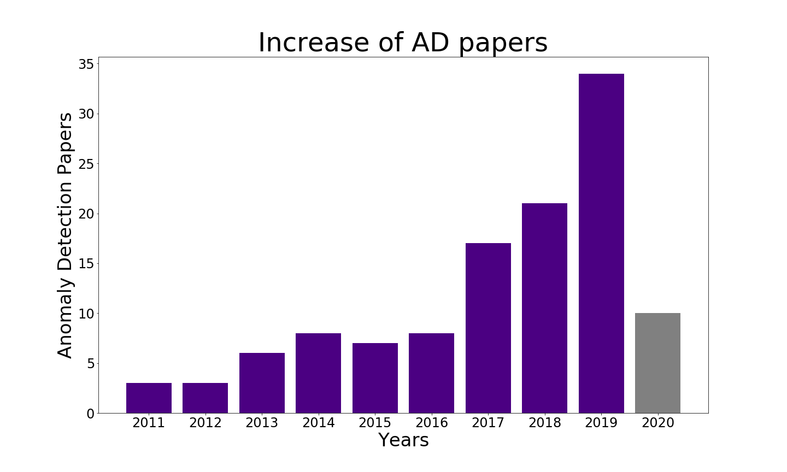

# Awesome Machine Learning for Anomaly Detection
* Keyword: novelty detection, anomaly detection, out-of-distribution detection, outlier detection
* Conference: ICLR, ICML, NIPS, KDD, ICCV, CVPR  
  

_Last updated: 2020.10.29_  

연도별로 Anomaly Detection 관련 논문들을 정리한 자료입니다. 시간 순으로 Anomaly Detection 관련 논문들이 어떻게 발전했는지, 또 얼마나 증가했는지 알아보고자 합니다. [이호성님 github awesome-anomaly-detection](https://github.com/hoya012/awesome-anomaly-detection) 을 보고 영감을 얻었습니다.   

ICLR, ICML, NIPS, KDD, ICCV, CVPR 총 6개의 학회에서 Novelty Detection, Anomaly Detection, Out-of-Distribution Detection, Outlier Detection을 키워드로 찾은 논문들을 공유합니다. 일부 해당 키워드를 가지고 있지 않더라도 관련이 있어 보이는 논문들도 포함했습니다. (혹시 아무 관련 없어 보이는 논문이 있다면 말씀해 주세요:-) )  

전체 submit/acceptance 논문 수가 많아지는 만큼, Anomaly Detection 관련 논문들도 해마다 증가하네요!

  

|      |           |   ICLR   |           |           |   NIPS   |            |           |   ICML   |           |           |   KDD    |           |           |   ICCV   |           |           |   CVPR   |           |           |  Total   |           |
| :--: | :-------: | :------: | :-------: | :-------: | :------: | :--------: | :-------: | :------: | :-------: | :-------: | :------: | :-------: | :-------: | :------: | :-------: | :-------: | :------: | :-------: | :-------: | :------: | :-------: |
|      | submitted | accepted | AD-papers | submitted | accepted | AD-papers | submitted | accepted | AD-papers | submitted | accepted | AD-papers | submitted | accepted | AD-papers | submitted | accepted | AD-papers | submitted | accepted | AD-papers |
| 2020 |   2594    |   687    |    10     |   9467    |   1900   |     7     |   4990    |  1,088   |     2     |   1279    |   216    |     5     |     0     |    0     |     0     |   6656    |   1470   |     4     |   24986   |  5,361   |    28     |
| 2019 |   1591    |   500    |     1     |   6743    |   1428   |     8      |   3424    |   773    |     3     |   1200    |   170    |     8     |   4303    |   1077   |     4     |   5160    |   1294   |    10     |   22421   |   5242   |    34     |
| 2018 |    941    |   314    |     3     |   4856    |   1011   |     6      |   2473    |   621    |     1     |    983    |   181    |     7     |     0     |    0     |     0     |   3303    |   979    |     4     |   12556   |   3106   |    21     |
| 2017 |    507    |   198    |     5     |   3240    |   678    |     1      |   1676    |   434    |     0     |    748    |   130    |     6     |   2143    |   621    |     3     |   2620    |   783    |     2     |   10934   |   2844   |    17     |
| 2016 |           |          |           |   2403    |   569    |     1      |           |   322    |     2     |   1115    |   142    |     3     |     0     |    0     |     0     |   2145    |   643    |     2     |   5663    |   1676   |     8     |
| 2015 |           |          |           |   1838    |   403    |     0      |   1037    |   270    |     1     |    819    |   160    |     3     |   1698    |   525    |     2     |   2123    |   602    |     1     |   7515    |   1960   |     7     |
| 2014 |           |          |           |   1678    |   414    |     1      |           |          |     2     |   1036    |   151    |     4     |     0     |    0     |     0     |   1807    |   540    |     1     |   4521    |   1105   |     8     |
| 2013 |           |          |           |           |          |     2      |           |          |           |           |          |     1     |   1629    |   454    |     0     |           |          |     3     |   1629    |   454    |     6     |
| 2012 |           |          |           |           |          |     1      |           |          |           |           |          |     2     |           |          |           |           |          |           |     0     |    0     |     3     |
| 2011 |           |          |           |           |          |     2      |           |          |           |           |          |     1     |           |          |           |           |          |           |     0     |    0     |     3     |
|      |   5633    |   1699   |    19     |   30225   |   6403   |    29     |   13600   |   3508   |    11     |   7180    |   1150   |    40     |   9773    |   2677   |     9     |   23814   |   6311   |    27     |   90225   |  21748   |    135    |

# 2020 (10 papers)

- RaPP(Novelty Detection with Reconstruction along Projection Pathway) | __[ICLR]__ | [pdf](https://openreview.net/pdf?id=HkgeGeBYDB)
- Novelty Detection Via Blurring | __[ICLR]__ | [pdf](https://openreview.net/pdf?id=ByeNra4FD)
- Deep Semi-Supervised Anomaly Detection | __[ICLR]__ | [pdf](https://openreview.net/pdf?id=HkgH0TEYwH)
- Robust anomaly detection and backdoor attack detection via differential privacy | __[ICLR]__ | [pdf](https://openreview.net/pdf?id=SJx0q1rtvS)
- Classification-Based Anomaly Detection for General Data | __[ICLR]__ | [pdf](https://openreview.net/pdf?id=H1lK_lBtvS)
- Robust Subspace Recovery Layer for Unsupervised Anomaly Detection | __[ICLR]__ | [pdf](https://openreview.net/pdf?id=rylb3eBtwr)
- Input Complexity and Out-of-distribution Detection with Likelihood-based Generative Models | __[ICLR]__ | [pdf](https://openreview.net/pdf?id=SyxIWpVYvr)
- Learning to Balance: Bayesian Meta-Learning for Imbalanced and Out-of-distribution Tasks(ORAL) | __[ICLR]__ | [pdf](https://openreview.net/pdf?id=rkeZIJBYvr)
- Iterative energy-based projection on a normal data manifold for anomaly localization | __[ICLR]__ | [pdf](https://openreview.net/pdf?id=HJx81ySKwr)
- Neural Outlier Rejection for Self-Supervised Keypoint Learning | __[ICLR]__ | [pdf](https://openreview.net/pdf?id=Skx82ySYPH)
- Understanding Anomaly Detection with Deep Invertible Networks through Hierarchies of Distributions and Features | __[NIPS]__ | [pdf](https://arxiv.org/pdf/2006.10848.pdf)
- Timeseries Anomaly Detection using Temporal Hierarchical One-Class Network | __[NIPS]__ |
- CSI: Novelty Detection via Contrastive Learning on Distributionally Shifted Instances | __[NIPS]__ | [pdf](https://arxiv.org/pdf/2007.08176.pdf)
- Further Analysis of Outlier Detection with Deep Generative Models | __[NIPS]__ | [pdf](https://arxiv.org/pdf/2010.13064.pdf)
- Likelihood Regret: An Out-of-Distribution Detection Score For Variational Auto-encoder | __[NIPS]__ | [pdf](https://arxiv.org/pdf/2003.02977.pdf)
- OOD-MAML: Meta-Learning for Few-Shot Out-of-Distribution Detection and Classification | __[NIPS]__ |
- Energy-based Out-of-distribution Detection | __[NIPS]__ | [pdf](https://arxiv.org/pdf/2010.03759.pdf)
- Towards Maximizing the Representation Gap between In-Domain & Out-of-Distribution Examples | __[NIPS]__ | [pdf](https://arxiv.org/pdf/2010.10474.pdf)
- Why Normalizing Flows Fail to Detect Out-of-Distribution Data | __[NIPS]__ | [pdf](https://invertibleworkshop.github.io/accepted_papers/pdfs/20.pdf)
- Interpretable, Multidimensional, Multimodal Anomaly Detection with Negative Sampling for Detection of Device Failure | __[ICML]__ | [pdf](https://arxiv.org/pdf/2007.10088.pdf)
- Detecting Out-of-Distribution Examples with Gram Matrices | __[ICML]__ | [pdf](https://proceedings.icml.cc/static/paper_files/icml/2020/5813-Paper.pdf)
- Isolation Distributional Kernel: A new tool for kernel based anomaly detection | __[KDD]__ | [pdf](https://dl.acm.org/doi/pdf/10.1145/3394486.3403062)
- USAD : UnSupervised Anomaly Detection on multivariate time series | __[KDD]__ | [pdf](https://dl.acm.org/doi/pdf/10.1145/3394486.3403392)
- Multi-class Data Description for Out-of-distribution Detection | __[KDD]__ | [pdf](https://dl.acm.org/doi/pdf/10.1145/3394486.3403189)
- Generic Outlier Detection in Multi-Armed Bandit | __[KDD]__ | [pdf](https://dl.acm.org/doi/pdf/10.1145/3394486.3403134) 
- Ultrafast Local Outlier Detection from a Data Stream with Stationary Region Skipping | __[KDD]__ | [pdf](https://dl.acm.org/doi/pdf/10.1145/3394486.3403171)
- Graph Embedded Pose Clustering for Anomaly Detection | __[CVPR]__ | [pdf](https://openaccess.thecvf.com/content_CVPR_2020/papers/Markovitz_Graph_Embedded_Pose_Clustering_for_Anomaly_Detection_CVPR_2020_paper.pdf)
- Uninformed Students: Student-Teacher Anomaly Detection With Discriminative Latent Embeddings | __[CVPR]__ | [pdf](https://openaccess.thecvf.com/content_CVPR_2020/papers/Bergmann_Uninformed_Students_Student-Teacher_Anomaly_Detection_With_Discriminative_Latent_Embeddings_CVPR_2020_paper.pdf)
- Learning Memory-Guided Normality for Anomaly Detection | __[CVPR]__ | [pdf](https://openaccess.thecvf.com/content_CVPR_2020/papers/Park_Learning_Memory-Guided_Normality_for_Anomaly_Detection_CVPR_2020_paper.pdf)
- Self-Trained Deep Ordinal Regression for End-to-End Video Anomaly Detection | __[CVPR]__ | [pdf](https://openaccess.thecvf.com/content_CVPR_2020/papers/Pang_Self-Trained_Deep_Ordinal_Regression_for_End-to-End_Video_Anomaly_Detection_CVPR_2020_paper.pdf)

# 2019 (34 papers)

* Deep Anomaly Detection with Outlier Exposure | __[ICLR]__ | [pdf](https://arxiv.org/pdf/1812.04606)
* Multivariate Triangular Quantile Maps for Novelty Detection | __[NIPS]__ | [pdf](https://papers.nips.cc/paper/8750-multivariate-triangular-quantile-maps-for-novelty-detection.pdf)
* Transfer Anomaly Detection by Inferring Latent Domain Representations | __[NIPS]__ | [pdf](https://papers.nips.cc/paper/8517-transfer-anomaly-detection-by-inferring-latent-domain-representations.pdf)
* Statistical Analysis of Nearest Neighbor Methods for Anomaly Detection | __[NIPS]__ | [pdf](https://papers.nips.cc/paper/9274-statistical-analysis-of-nearest-neighbor-methods-for-anomaly-detection.pdf)
* PIDForest: Anomaly Detection via Partial Identification | __[NIPS]__ | [pdf](https://papers.nips.cc/paper/9710-pidforest-anomaly-detection-via-partial-identification.pdf)
* Likelihood Ratios for Out-of-Distribution Detection | __[NIPS]__ | [pdf](http://papers.nips.cc/paper/9611-likelihood-ratios-for-out-of-distribution-detection.pdf)
* Quantum Entropy Scoring for Fast Robust Mean Estimation and Improved Outlier Detection | __[NIPS]__ | [pdf](http://papers.nips.cc/paper/8839-quantum-entropy-scoring-for-fast-robust-mean-estimation-and-improved-outlier-detection.pdf)
* The Cells Out of Sample (COOS) dataset and benchmarks for measuring out-of-sample generalization of image classifiers | __[NIPS]__ | [pdf](https://papers.nips.cc/paper/8461-the-cells-out-of-sample-coos-dataset-and-benchmarks-for-measuring-out-of-sample-generalization-of-image-classifiers.pdf)
* Effective End-to-end Unsupervised Outlier Detection via Inlier Priority of Discriminative Network | __[NIPS]__ | [pdf](http://papers.nips.cc/paper/8830-effective-end-to-end-unsupervised-outlier-detection-via-inlier-priority-of-discriminative-network.pdf)
* Anomaly Detection With Multiple-Hypotheses Predictions | __[ICML]__ | [pdf](https://arxiv.org/pdf/1810.13292)
* Curiosity-Bottleneck: Exploration By Distilling Task-Specific Novelty | __[ICML]__ | [pdf](http://proceedings.mlr.press/v97/kim19c/kim19c.pdf)
* Improving Neural Network Quantization without Retraining using Outlier Channel Splitting | __[ICML]__ | [pdf](http://proceedings.mlr.press/v97/zhao19c/zhao19c.pdf)
* Deep Anomaly Detection with Deviation Networks | **[KDD]** | [pdf](https://arxiv.org/pdf/1911.08623)
* Fast and Accurate Anomaly Detection in Dynamic Graphs with a Two-Pronged Approach | **[KDD]**
* Sequential Anomaly Detection using Inverse Reinforcement Learning | **[KDD]**
* Anomaly Detection for an E-commerce Pricing System | **[KDD]** | [pdf](https://arxiv.org/pdf/1902.09566)
* Context by Proxy: Identifying Contextual Anomalies Using an Output Proxy | **[KDD]**
* Detecting Anomalies in Space using Multivariate Convolutional LSTM with Mixtures of Probabilistic PCA | **[KDD]**
* Robust Anomaly Detection for Multivariate Time Series through Stochastic Recurrent Neural Network | **[KDD]**  | [pdf](https://netman.aiops.org/wp-content/uploads/2019/08/OmniAnomaly_camera-ready.pdf)
* Time-Series Anomaly Detection Service at Microsoft | __[KDD]__ | [pdf](https://arxiv.org/pdf/1906.03821)
* Memorizing Normality to Detect Anomaly: Memory-Augmented Deep Autoencoder for Unsupervised Anomaly Detection | __[ICCV]__ | [pdf](http://openaccess.thecvf.com/content_ICCV_2019/papers/Gong_Memorizing_Normality_to_Detect_Anomaly_Memory-Augmented_Deep_Autoencoder_for_Unsupervised_ICCV_2019_paper.pdf)
* Anomaly Detection in Video Sequence With Appearance-Motion Correspondence | __[ICCV]__ | [pdf](http://openaccess.thecvf.com/content_ICCV_2019/papers/Nguyen_Anomaly_Detection_in_Video_Sequence_With_Appearance-Motion_Correspondence_ICCV_2019_paper.pdf)
* GODS: Generalized One-Class Discriminative Subspaces for Anomaly Detection | __[ICCV]__ | [pdf](http://openaccess.thecvf.com/content_ICCV_2019/papers/Wang_GODS_Generalized_One-Class_Discriminative_Subspaces_for_Anomaly_Detection_ICCV_2019_paper.pdf)
* Unsupervised Out-of-Distribution Detection by Maximum Classifier Discrepancy | __[ICCV]__ | [pdf](http://openaccess.thecvf.com/content_ICCV_2019/papers/Yu_Unsupervised_Out-of-Distribution_Detection_by_Maximum_Classifier_Discrepancy_ICCV_2019_paper.pdf)
* Latent Space Autoregression for Novelty Detection | __[CVPR]__ | [pdf](http://openaccess.thecvf.com/content_CVPR_2019/papers/Abati_Latent_Space_Autoregression_for_Novelty_Detection_CVPR_2019_paper.pdf)
* OCGAN: One-Class Novelty Detection Using GANs With Constrained Latent Representations | __[CVPR]__ | [pdf](http://openaccess.thecvf.com/content_CVPR_2019/papers/Perera_OCGAN_One-Class_Novelty_Detection_Using_GANs_With_Constrained_Latent_Representations_CVPR_2019_paper.pdf)
* Where's Wally Now? Deep Generative and Discriminative Embeddings for Novelty Detection | __[CVPR]__ | [pdf](http://openaccess.thecvf.com/content_CVPR_2019/papers/Burlina_Wheres_Wally_Now_Deep_Generative_and_Discriminative_Embeddings_for_Novelty_CVPR_2019_paper.pdf)
* Deep Transfer Learning for Multiple Class Novelty Detection | __[CVPR]__ | [pdf](http://openaccess.thecvf.com/content_CVPR_2019/papers/Perera_Deep_Transfer_Learning_for_Multiple_Class_Novelty_Detection_CVPR_2019_paper.pdf)
* Graph Convolutional Label Noise Cleaner: Train a Plug-And-Play Action Classifier for Anomaly Detection | __[CVPR]__ | [pdf](http://openaccess.thecvf.com/content_CVPR_2019/papers/Zhong_Graph_Convolutional_Label_Noise_Cleaner_Train_a_Plug-And-Play_Action_Classifier_CVPR_2019_paper.pdf)
* MVTec AD -- A Comprehensive Real-World Dataset for Unsupervised Anomaly Detection | __[CVPR]__ | [pdf](http://openaccess.thecvf.com/content_CVPR_2019/papers/Bergmann_MVTec_AD_--_A_Comprehensive_Real-World_Dataset_for_Unsupervised_Anomaly_CVPR_2019_paper.pdf)
* Learning Regularity in Skeleton Trajectories for Anomaly Detection in Videos | __[CVPR]__  | [pdf](http://openaccess.thecvf.com/content_CVPR_2019/papers/Morais_Learning_Regularity_in_Skeleton_Trajectories_for_Anomaly_Detection_in_Videos_CVPR_2019_paper.pdf)
* Out-Of-Distribution Detection for Generalized Zero-Shot Action Recognition | __[CVPR]__  | [pdf](http://openaccess.thecvf.com/content_CVPR_2019/papers/Mandal_Out-Of-Distribution_Detection_for_Generalized_Zero-Shot_Action_Recognition_CVPR_2019_paper.pdf)
* Object-Centric Auto-Encoders and Dummy Anomalies for Abnormal Event Detection in Video | __[CVPR]__ | [pdf](http://openaccess.thecvf.com/content_CVPR_2019/papers/Ionescu_Object-Centric_Auto-Encoders_and_Dummy_Anomalies_for_Abnormal_Event_Detection_in_CVPR_2019_paper.pdf)
* ManTra-Net: Manipulation Tracing Network for Detection and Localization of Image Forgeries With Anomalous Features | __[CVPR]__ | [pdf](http://openaccess.thecvf.com/content_CVPR_2019/papers/Wu_ManTra-Net_Manipulation_Tracing_Network_for_Detection_and_Localization_of_Image_CVPR_2019_paper.pdf)

# 2018 (21 papers)

* Deep Autoencoding Gaussian Mixture Model for Unsupervised Anomaly Detection  | __[ICLR]__ | [pdf](https://openreview.net/pdf?id=BJJLHbb0-)
* Enhancing The Reliability of Out-of-distribution Image Detection in Neural Networks  | __[ICLR]__ | [pdf](https://arxiv.org/pdf/1706.02690)
* Training Confidence-calibrated Classifiers for Detecting Out-of-Distribution Samples | __[ICLR]__ | [pdf](https://arxiv.org/pdf/1711.09325.pdf)
* Improving Exploration in Evolution Strategies for Deep Reinforcement Learning via a Population of Novelty-Seeking Agents | __[NIPS]__ | [pdf](http://papers.nips.cc/paper/7750-improving-exploration-in-evolution-strategies-for-deep-reinforcement-learning-via-a-population-of-novelty-seeking-agents.pdf)
* Generative Probabilistic Novelty Detection with Adversarial Autoencoders | __[NIPS]__ | [pdf](https://papers.nips.cc/paper/7915-generative-probabilistic-novelty-detection-with-adversarial-autoencoders.pdf)
* Efficient Anomaly Detection via Matrix Sketching | __[NIPS]__ | [pdf](https://papers.nips.cc/paper/8030-efficient-anomaly-detection-via-matrix-sketching.pdf)
* Deep Anomaly Detection Using Geometric Transformations | __[NIPS]__ | [pdf](https://papers.nips.cc/paper/8183-deep-anomaly-detection-using-geometric-transformations.pdf)
* A loss framework for calibrated anomaly detection | __[NIPS]__ | [pdf](https://papers.nips.cc/paper/7422-a-loss-framework-for-calibrated-anomaly-detection.pdf)
* Out-of-Distribution Detection using Multiple Semantic Label Representations | __[NIPS]__ | [pdf](http://papers.nips.cc/paper/7967-out-of-distribution-detection-using-multiple-semantic-label-representations.pdf)
* Do Outliers Ruin Collaboration? | __[ICML]__ | [pdf](https://arxiv.org/pdf/1805.04720)
* NetWalk: A Flexible Deep Embedding Approach for Anomaly Detection in Dynamic Networks | __[KDD]__ | [pdf](http://shichuan.org/hin/topic/Embedding/2018.KDD%202018%20NetWalk_A%20Flexible%20Deep%20Embedding%20Approach%20for%20Anomaly%20Detection%20in%20Dynamic%20Networks.pdf)
* SpotLight: Detecting Anomalies in Streaming Graphs | __[KDD]__ | [pdf](https://dl.acm.org/ft_gateway.cfm?id=3220040&type=pdf)
* Feedback-Guided Anomaly Discovery via Online Optimization | __[KDD]__ | [pdf](http://web.engr.oregonstate.edu/~afern/papers/kdd18-siddiqui.pdf)
* Detecting Spacecraft Anomalies Using LSTMs and Nonparametric Dynamic Thresholding | __[KDD]__ | [pdf](https://arxiv.org/pdf/1802.04431)
* xStream: Outlier Detection in Feature-Evolving Data Streams | __[KDD]__ | [pdf](https://pdfs.semanticscholar.org/a0e0/ce316ce0fdca2db61a52fdc7100e24906075.pdf)
* Learning Representations of Ultrahigh-dimensional Data for Random Distance-based Outlier Detection | __[KDD]__ | [pdf](https://arxiv.org/pdf/1806.04808.pdf)
* DILOF: Effective and Memory Efficient Local Outlier Detection in Data Streams | __[KDD]__
* Hierarchical Novelty Detection for Visual Object Recognition | __[CVPR]__ | [pdf](http://openaccess.thecvf.com/content_cvpr_2018/papers/Lee_Hierarchical_Novelty_Detection_CVPR_2018_paper.pdf)
* Adversarially Learned One-Class Classifier for Novelty Detection | __[CVPR]__ | [pdf](http://openaccess.thecvf.com/content_cvpr_2018/papers/Sabokrou_Adversarially_Learned_One-Class_CVPR_2018_paper.pdf)
* Real-World Anomaly Detection in Surveillance Videos | __[CVPR]__ | [pdf](http://openaccess.thecvf.com/content_cvpr_2018/papers/Sultani_Real-World_Anomaly_Detection_CVPR_2018_paper.pdf)
* Future Frame Prediction for Anomaly Detection – A New Baseline | __[CVPR]__  | [pdf](http://openaccess.thecvf.com/content_cvpr_2018/papers/Liu_Future_Frame_Prediction_CVPR_2018_paper.pdf)

# 2017 (17 papers)

* Adversarial Autoencoders for Novelty Detection | __[ICLR]__ | [pdf](https://openreview.net/pdf?id=SyuncaEKx)
* A Baseline for Detecting Misclassified and Out-of-Distribution Examples in Neural Networks | __[ICLR]__ | [pdf](https://arxiv.org/pdf/1610.02136.pdf)
* Efficient variational Bayesian neural network ensembles for outlier detection | __[ICLR]__ | [pdf](https://arxiv.org/pdf/1703.06749)
* Out-of-class novelty generation: an experimental foundation | __[ICLR]__ | [pdf](https://hal.archives-ouvertes.fr/hal-01773776/document)
* Transfer of View-manifold Learning to Similarity Perception of Novel Objects | __[ICLR]__ | [pdf](https://arxiv.org/pdf/1704.00033)
* Identifying Outlier Arms in Multi-Armed Bandit | __[NIPS]__  | [pdf](https://papers.nips.cc/paper/7105-identifying-outlier-arms-in-multi-armed-bandit.pdf)
* Anomaly Detection with Robust Deep Auto-encoders | __[KDD]__ | [pdf](https://pdfs.semanticscholar.org/c112/b06d3dac590b4cc111e5ec9c805d0b086c6e.pdf)
* Anomaly Detection in Streams with Extreme Value Theory | __[KDD]__ | [pdf](https://hal.archives-ouvertes.fr/hal-01640325/file/siffer_kdd_17.pdf)
* Distributed Local Outlier Detection in Big Data | __[KDD]__ | [pdf](https://www.researchgate.net/profile/Lei_Cao18/publication/318920558_Distributed_Local_Outlier_Detection_in_Big_Data/links/598c7d7d458515c333a9cf35/Distributed-Local-Outlier-Detection-in-Big-Data.pdf)
* REMIX: Automated Exploration for Interactive Outlier Detection | __[KDD]__ | [pdf](https://arxiv.org/pdf/1705.05986)
* Scalable Top-n Local Outlier Detection | __[KDD]__
* Contextual Spatial Outlier Detection with Metric Learning | __[KDD]__ | [pdf](http://library.usc.edu.ph/ACM/KKD%202017/pdfs/p2161.pdf)
* A Revisit of Sparse Coding Based Anomaly Detection in Stacked RNN Framework | __[ICCV]__ | [pdf](http://openaccess.thecvf.com/content_ICCV_2017/papers/Luo_A_Revisit_of_ICCV_2017_paper.pdf)
* Blind Image Deblurring With Outlier Handling | __[ICCV]__ | [pdf](http://openaccess.thecvf.com/content_ICCV_2017/papers/Dong_Blind_Image_Deblurring_ICCV_2017_paper.pdf)
* Summarization and Classification of Wearable Camera Streams by Learning the Distributions Over Deep Features of Out-Of-Sample Image Sequences | __[ICCV]__ | [pdf](http://openaccess.thecvf.com/content_ICCV_2017/papers/Perina_Summarization_and_Classification_ICCV_2017_paper.pdf)
* Incremental Kernel Null Space Discriminant Analysis for Novelty Detection | __[CVPR]__  | [pdf](http://openaccess.thecvf.com/content_cvpr_2017/papers/Liu_Incremental_Kernel_Null_CVPR_2017_paper.pdf)
* Provable Self-Representation Based Outlier Detection in a Union of Subspaces | __[CVPR]__ | [pdf](http://openaccess.thecvf.com/content_cvpr_2017/papers/You_Provable_Self-Representation_Based_CVPR_2017_paper.pdf)

# 2016 (8 papers)

* Multi-view Anomaly Detection via Robust Probabilistic Latent Variable Models | __[NIPS]__ | [pdf](https://papers.nips.cc/paper/6456-multi-view-anomaly-detection-via-robust-probabilistic-latent-variable-models.pdf)
* Deep Structured Energy Based Models for Anomaly Detection | __[ICML]__ | [pdf](http://www.jmlr.org/proceedings/papers/v48/zhai16.pdf)
* Robust Random Cut Forest Based Anomaly Detection on Streams | __[ICML]__ | [pdf](http://www.jmlr.org/proceedings/papers/v48/guha16.pdf)
* Anomaly Detection Using Program Control Flow Graph Mining from Execution Logs (oral) | __[KDD]__ | [pdf](https://arxiv.org/pdf/1404.4679)
* Fast Memory-efficient Anomaly Detection in Streaming Heterogeneous Graphs | __[KDD]__ | [pdf](https://pdfs.semanticscholar.org/0291/036c6efd99d7f141011c7c08bc4751eecd03.pdf)
* Semi-Markov Switching Vector Autoregressive Model-based Anomaly Detection in Aviation Systems | __[KDD]__  | [pdf](https://arxiv.org/pdf/1602.06550)
* Guaranteed Outlier Removal With Mixed Integer Linear Programs | __[CVPR]__ | [pdf](https://www.cv-foundation.org/openaccess/content_cvpr_2016/papers/Chin_Guaranteed_Outlier_Removal_CVPR_2016_paper.pdf)
* Deep Compositional Captioning: Describing Novel Object Categories Without Paired Training Data | __[CVPR]__ | [pdf](https://www.cv-foundation.org/openaccess/content_cvpr_2016/papers/Hendricks_Deep_Compositional_Captioning_CVPR_2016_paper.pdf)

# 2015  (7 papers)

* Hidden Markov Anomaly Detection | __[ICML]__ | [pdf](http://www.jmlr.org/proceedings/papers/v37/goernitz15.pdf)
* Social Media Anomaly Detection: Challenges and Solutions | __[KDD]__
* Generic and Scalable Framework for Automated Time-series Anomaly Detection | __[KDD]__ | [pdf](https://netman.aiops.org/~peidan/ANM2019/5.KPIAnomalyDetection/ReadingLists/2015KDD_Generic%20and%20Scalable%20Framework%20for%20Automated%20Time-series%20Anomaly%20Detection.pdf)
* Online Outlier Exploration Over Large Datasets | __[KDD]__ | [pdf](http://www.eecs.yorku.ca/course_archive/2016-17/W/6412/reading/OnlineOutlierExplorationKDD15.pdf)
* Learning Discriminative Reconstructions for Unsupervised Outlier Removal | __[ICCV]__ | [pdf](http://openaccess.thecvf.com/content_iccv_2015/papers/Xia_Learning_Discriminative_Reconstructions_ICCV_2015_paper.pdf)
* Guaranteed Outlier Removal for Rotation Search | __[ICCV]__ | [pdf](https://www.cv-foundation.org/openaccess/content_iccv_2015/papers/Bustos_Guaranteed_Outlier_Removal_ICCV_2015_paper.pdf)
* Video Anomaly Detection and Localization Using Hierarchical Feature Representation and Gaussian Process Regression | __[CVPR]__  | [pdf](https://www.cv-foundation.org/openaccess/content_cvpr_2015/papers/Cheng_Video_Anomaly_Detection_2015_CVPR_paper.pdf)

# 2014 (8 papers)

* On Integrated Clustering and Outlier Detection | __[NIPS]__  | [pdf](https://papers.nips.cc/paper/5306-on-integrated-clustering-and-outlier-detection.pdf)
* Anomaly Ranking as Supervised Bipartite Ranking | __[ICML]__ | [pdf](http://proceedings.mlr.press/v32/clemencon14.pdf)
* Hierarchical Conditional Random Fields for Outlier Detection: An Application to Detecting Epileptogenic Cortical Malformations | __[ICML]__ | [pdf](http://www.jmlr.org/proceedings/papers/v32/ahmed14.pdf)
* Sleep analytics and online selective anomaly detection | __[KDD]__ | [pdf](https://arxiv.org/pdf/1403.0156.pdf)
* GLAD: group anomaly detection in social media analysis | __[KDD]__ | [pdf](https://arxiv.org/pdf/1410.1940)
* Detecting moving object outliers in massive-scale trajectory streams | __[KDD]__ | [pdf](https://www.researchgate.net/profile/Yanwei_Yu/publication/266660277_Detecting_moving_object_outliers_in_massive-scale_trajectory_streams/links/54a114a30cf267bdb9017156.pdf)
* Focused clustering and outlier detection in large attributed graphs | __[KDD]__ | [pdf](http://citeseerx.ist.psu.edu/viewdoc/download?doi=10.1.1.643.4651&rep=rep1&type=pdf)
* Unsupervised One-Class Learning for Automatic Outlier Removal | __[CVPR]__ | [pdf](https://www.cv-foundation.org/openaccess/content_cvpr_2014/papers/Liu_Unsupervised_One-Class_Learning_2014_CVPR_paper.pdf)

# 2013 (6 papers)

* Near-optimal Anomaly Detection in Graphs using Lovasz Extended Scan Statistic | __[NIPS]__  | [pdf](https://papers.nips.cc/paper/5156-near-optimal-anomaly-detection-in-graphs-using-lovasz-extended-scan-statistic.pdf)
* Rapid Distance-Based Outlier Detection via Sampling | __[NIPS]__ | [pdf](http://papers.nips.cc/paper/5127-rapid-distance-based-outlier-detection-via-sampling.pdf)
* Subsampling for efficient and effective unsupervised outlier detection ensembles | __[KDD]__ | [pdf](http://www.eiti.uottawa.ca/~nat/Courses/csi5387_Winter2014/paper12.pdf)
* Kernel Null Space Methods for Novelty Detection | __[CVPR]__  | [pdf](https://www.cv-foundation.org/openaccess/content_cvpr_2013/papers/Bodesheim_Kernel_Null_Space_2013_CVPR_paper.pdf)
* Online Dominant and Anomalous Behavior Detection in Videos | __[CVPR]__ | [pdf](http://openaccess.thecvf.com/content_cvpr_2013/papers/Roshtkhari_Online_Dominant_and_2013_CVPR_paper.pdf)
* Object-Centric Anomaly Detection by Attribute-Based Reasoning | __[CVPR]__ | [pdf](http://openaccess.thecvf.com/content_cvpr_2013/papers/Saleh_Object-Centric_Anomaly_Detection_2013_CVPR_paper.pdf)

# 2012 (3 papers)

* Multi-criteria Anomaly Detection using Pareto Depth Analysis | __[NIPS]__ | [pdf](http://papers.nips.cc/paper/4612-multi-criteria-anomaly-detection-using-pareto-depth-analysis.pdf)
* A Near-linear Time Approximation Algorithm for Angle-based Outlier Detection in High-dimensional Data | __[KDD]__ | [pdf](https://pure.itu.dk/ws/files/38198304/rt613_pham.pdf)
* Integrating Community Matching and Outlier Detection for Mining Evolutionary Community Outliers | __[KDD]__ | [pdf](http://citeseerx.ist.psu.edu/viewdoc/download?doi=10.1.1.301.2979&rep=rep1&type=pdf)

# 2011 (3 papers)

* Efficient anomaly detection using bipartite k-NN graphs | __[NIPS]__ | [pdf](https://papers.nips.cc/paper/4287-efficient-anomaly-detection-using-bipartite-k-nn-graphs.pdf)
* Group Anomaly Detection using Flexible Genre Models | __[NIPS]__ | [pdf](https://papers.nips.cc/paper/4299-group-anomaly-detection-using-flexible-genre-models.pdf)
* Algorithms for speeding up distance-based outlier detection | __[KDD]__ | [pdf](https://www.academia.edu/download/51340953/Algorithms_for_speeding_up_distance-base20170113-9273-hnps66.pdf)

