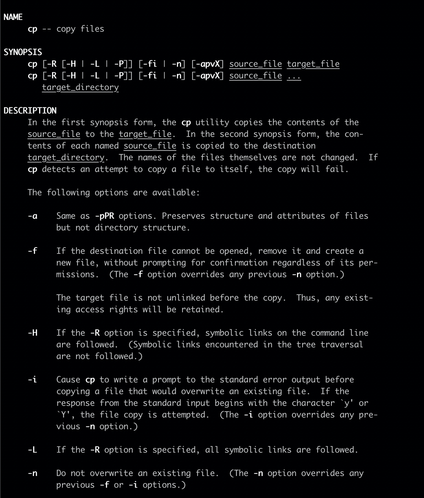

지금까지 Linux를 접하며 서버에 접속해보고 Linux 서버에서 많은 머신러닝 실험을 돌려보면서도, 'Linux를 다룬다' 라고 생각하진 않았습니다. 최근 도커를 공부하며 Linux 기초를 공부하고 싶다는 생각이 들었습니다. 인프런에 올라온 [생활코딩 - Linux]([https://www.inflearn.com/course/%EC%83%9D%ED%99%9C%EC%BD%94%EB%94%A9-%EB%A6%AC%EB%88%85%EC%8A%A4-%EA%B0%95%EC%A2%8C/dashboard](https://www.inflearn.com/course/생활코딩-리눅스-강좌/dashboard)) 을 주말동안 들었고, 그 내용을 정리했음을 밝힙니다. 개인적으로 끄적끄적 사용해보던 Linux에 대해 직접 공부해보니 무척 재밌더라구요! 쉘의 개념, 권한, 네트워크 등 정말 흥미로운 내용을 담고 있으니 직접 수강해보기를 추천드립니다. 시간을 아끼시고 싶으신 분은 블로그 내용을 참고해도 좋을 것 같습니다 ☺️

## 시작하며

Linux는 UNIX 계열의 운영 체제이고, 소스 코드가 공개된 오픈소스 운영체제입니다. 우리나라에서는 Windows를 사용하는 사람이 많지만, 서버나 I.O.T 제품에 들어가는 컴퓨터는 Linux 기반인 경우가 <u>굉장히</u> 많고, 그만큼 개발자들에게 친숙한 운영체제입니다. Linux 기초에 대해 알아보도록 하겠습니다. 


## Linux 기초

### Linux 기초 명령어

아래 명령어들은 linux 계반 운영체제(Ubuntu, Mac)의 terminal에서 사용할 수 있습니다.

* ```shell
  $ ls  # 현재 디렉토리의 파일/폴더를 열람하는 명령어입니다.
  ```

* ```shell
  $ pwd  # 현재 디렉토리의 경로를 얻는 명령어입니다.
  ```

* ```shell
  $ mkdir some_dir  # 새로운 디렉토리를 만드는 명령어입니다.
  ```

* ```shell
  $ cd some_dir # 디렉토리로 접근하는 명령어입니다.
  ```

* ```shell
  $ rm some # 파일 혹은 폴더를 지우는 명령어입니다. 폴더를 지우기 위해서는 -r 이라는 옵션이 필요합니다.
  ```

* ```shell
  $ cp some1 some2  # 파일 혹은 폴더를 some2에 복사합니다.
  ```

* ```shell
  $ mv some1 some2  # 파일 혹은 폴더를 some2에 이동시킵니다. some1의 이름을 바꾸는 것으로도 활용할 수 있습니다.
  ```

* ```shell
  $ cat some_file  # 파일에 담긴 내용을 출력합니다.
  ```

### Linux 명령어 사용법 알기

명령어의 사용법을 제대로 아는 방법은 무엇일까요? 구글링도 정말 좋은 방법이지만, 무엇보다도 document를 읽는 것이 훌륭하다고 생각합니다.

* ```shell
  $ rm --help  # rm 명령어의 문서를 모니터에 출력합니다.
  ```

* ```shell
  $ man ls  # ls 명령어 문서를 열람합니다.
  ```

  * 문서 내에서 특정 keyword로 검색하고 싶을땐 /sort keyword 를 입력합니다. n 을 누르며 넘어갈 수 있습니다. 문서에서 나가고 싶을 때는 q를 누릅니다.

도움말을 읽을 수 있는 능력은 구글링을 하는 것과 마찬가지로 정말 중요합니다!  이 명령어를 어떻게 사용하는지, 무슨 옵션을 사용해야 하는지에 대한 정보를 담고 있습니다. 해당 도움말을 읽을 수 있다면 물고기를 잡는 방법을 아는거겠죠. 아래는 man 명령어로 접근한 cp 명령어 문서의 예시입니다. 운영체제마다 표현은 다를 수 있지만 가장 위에는 **어떤 명령어**인지, 다음은 **사용할 때의 모습**, 그 아래는 **해당 옵션에 대한 정보**를 담고 있습니다.




## IO Redirection


>[[UNIX 프로그램 기초](https://slideplayer.com/slide/5117573/)]

기본적으로 I/O 라는 것은 Input/Output을 의미합니다. 우리는 `ls -l`  라는 커맨드라인 명령어[__Input__]를 통해 프로그램을 실행시키고, 이 Unix 프로세스[__Process__]는 해당 디렉토리에 존재하는 파일/폴더에 대한 상세 정보[__Output__]를 출력합니다. 또, some_dir 이라는 폴더가 존재할 때, `mkdir some_dir` 이라는 명령어[__Input__]를 입력하면 해당 Unix 프로세스[__Process__]는 오류[__Output__] 를 출력합니다.

그렇다면 IO Redirection은 무엇을 의미할까요? Input / Output에 대한 방향을 바꿔준다는 의미입니다. 예를 들자면 프로그램의 출력이 모니터에 나와야 하는 것을 파일에 써준다거나, 실제 종이에 출력되도록 할 수 있겠죠. 또, 우리가 치는 명령어를 직접 치지 않고 파일에 적힌 내용으로 실행할 수 있도록 할 수 있습니다.

### Output Redirection

Output은 크게 Standard Output (오류가 없을 때)와 Standard Error(오류가 있을 때) 두가지로 나뉩니다. 보통의 경우 해당 출력은 보이는 모니터상에 출력됩니다. 이를 텍스트 파일로 Redirection 할 수 있습니다. Standard Output에 대한 Redirection >는 1>의 1이 생략된 것입니다.

* ```shell
  $ ls -l > result.txt  # Standard Output result.txt 에 저장
  ```

* ```shell
  $ mkdir some_dir 2> error.log  # Standard Error error.log 에 저장
  ```

* ```shell
  $ rm some.txt 1> output.txt 2> error.log  # 정상 작동하면 Output.txt에, 에러나면 error.lgo에 저장
  ```

### Input Redirection

Input도 마찬가지로 방향을 바꿔서 줄 수 있습니다. 보통은 명령어를 직접 치는 것으로 입력을 받는다면, 텍스트 파일 자체의 내용을 입력으로 줄 수 도 있는 것입니다.

* ```shell
  $ cat hello.txt  # 보통의 경우. hello.txt 의 내용을 출력한다. Command-line Input 임
  ```

* ```shell
  $ cat < hello.txt  # hello.txt의 내용을 데이터로써 Standard input으로 준 것 
  ```

### Redirection - Append

`>>` 혹은 `<<`를 사용하면 기존 내용에 추가적으로 더할 수 있습니다.

* ```shell
  $ ls -al >> result.txt
  ```

* ```shell
  $ mail hunhoon21@gmail.com << end
  ```

## 쉘과 쉘스크립트

### 쉘이란?

 
>[[쉘스크립트 튜토리얼](https://mindmajix.com/shell-scripting-tutorial)]

해당 그림은 쉘과 커널에 대한 개념을 잘 보여줍니다. Kernel은 하드웨어 자체(CPU, RAM 등)를 감싸고 있습니다. 즉, 하드웨어와 바로 소통하는 것입니다. 쉘은 껍데기처럼 커널을 감싸고 있습니다. 즉, 사용자(우리)의 명령어를 받아서 커널이 이해할 수 있도록 해주는 것이죠. 단순히 우리가 명령어를 입력하는 공간이라고 생각하셔도 괜찮습니다.

### Bash vs zsh

기본적으로 bash와 zsh는 거의 같다고 보셔도 무방합니다. 위 그림에서 보이는 바와 같이 bash와 zsh 둘 다 커널에 사용자의 명령을 전하는 Shell 입니다. 둘의 차이는 탭을 통한 자동완성 차이라고 보셔도 괜찮을 것 같습니다. 보통 zsh가 사용자 친화적이라고 알려져있고, 본인이 쓰는게 무엇인지 알고 싶다면 터미널에 `echo $0` 명령어를 입력하면 됩니다.  

### 쉘 스크립트

쉘 스크립트는 터미널에서 사용하는 명령어의 대본입니다. 컴퓨터는 쉘 스크립트대로 명령어를 실행합니다.

아래는 쉘 스크립트의 예시입니다.

```shell
#!/bin/bash  # 이 쉘 스크립트는 /bin/bash로 읽힌다.
if ! [ -d bak ]; then  # bak 이라는 디렉토리가 없으면
	mkdir bak  # back 디렉토리 생성
fi
cp *.log bak  # .log 로 끝나는 모든 파일 bak 디렉토리에 복사
```

머신러닝 모델의 성능을 한창 실험할 때도 이러한 쉘 스크립트를 사용해 많은 양의 파이썬 코드를 돌릴 수 있습니다. 아래는 예전에 다량의 실험을 돌릴 때 사용한 쉘 스크립트입니다. 물론 해당 작업을 파이썬 스크립트 내 for 문으로도 구현할 수 있습니다!

```
python3 test_novelty_detection.py --n_epochs 100 --model aae --target_class 0 --novelty_ratio 0.35 --n_layers 5
python3 test_novelty_detection.py --n_epochs 100 --model aae --target_class 0 --novelty_ratio 0.35 --n_layers 6
python3 test_novelty_detection.py --n_epochs 100 --model aae --target_class 0 --novelty_ratio 0.35 --n_layers 7
python3 test_novelty_detection.py --n_epochs 100 --model aae --target_class 0 --novelty_ratio 0.35 --n_layers 8
python3 test_novelty_detection.py --n_epochs 100 --model aae --target_class 0 --novelty_ratio 0.35 --n_layers 9
python3 test_novelty_detection.py --n_epochs 100 --model aae --target_class 0 --novelty_ratio 0.35 --n_layers 10
python3 test_novelty_detection.py --n_epochs 100 --model aae --target_class 0 --novelty_ratio 0.35 --n_layers 11
python3 test_novelty_detection.py --n_epochs 100 --model aae --target_class 0 --novelty_ratio 0.35 --n_layers 12
python3 test_novelty_detection.py --n_epochs 100 --model aae --target_class 0 --novelty_ratio 0.35 --n_layers 13
python3 test_novelty_detection.py --n_epochs 100 --model aae --target_class 0 --novelty_ratio 0.35 --n_layers 14
python3 test_novelty_detection.py --n_epochs 100 --model aae --target_class 0 --novelty_ratio 0.35 --n_layers 15
```


## 마치며

Linux는 현업에서 뗄 수 없는 존재입니다. 개인이 모델을 돌리는 것과 별개로 협업하고, 서버를 올려야 한다면 말이죠. 다음 시간에는 이번 포스팅보다 훨씬 재밌는 디렉토리, 사용자와 권한, 네트워크에 대해 알아보려고 합니다. 다음에 뵈어요 :) 