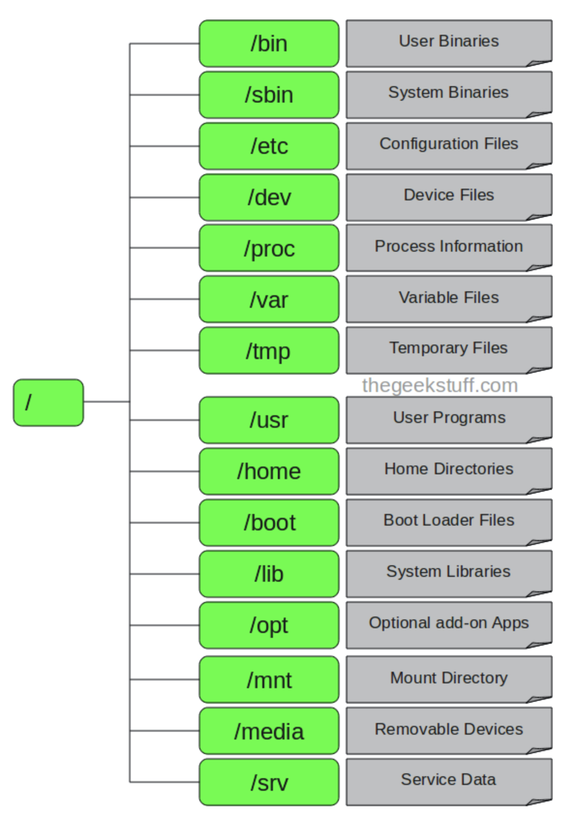
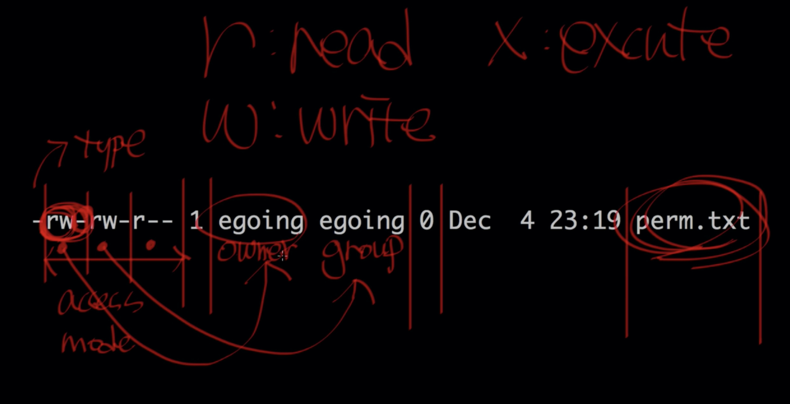
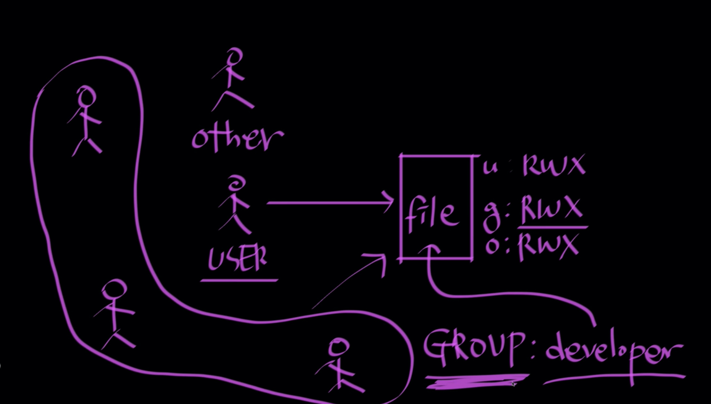
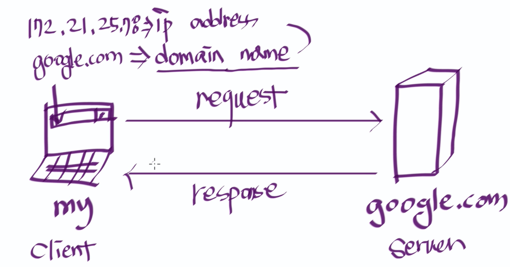
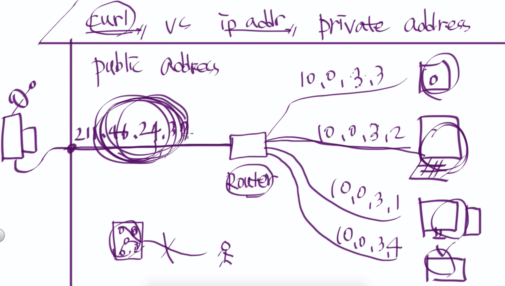

__Linux 기초에 대해 알아보자__ 시리즈 2번째 편입니다. 개인적으로 시리즈를 준비하며 사용법만 알았던 부분의 의미까지 이해할 수 있어 좋은 경험이었습니다. 아래에 나오는 명령어를 직접 리눅스에서 쳐보시기를 적극 권장 드립니다.

## 시작하며 
__Linux 기초에 대해 알아보자__ 2편은 
* 디렉토리 구조와 파일 찾는법

* 사용자와 권한

* 네트워크 기초  

  로 이루어져 있습니다.  

## 디렉토리 구조와 파일 찾는 법

Windows는 폴더라는 이름으로, UNIX 계열은 디렉토리라는 구조로 시스템이 구성되어 있습니다. Linux에서 디렉토리가 어떻게 구성되어 있는지, 특정한 파일에 대해 찾는 법에 대해 살펴보도록 하겠습니다.

### 디렉토리 구조 
 
>[위키피디아 file system 구조](https://www.thegeekstuff.com/2010/09/linux-file-system-structure/)

  * `/`
    * 가장 깊은 곳에 있는 Root directory입니다.
* `/bin`
    * User Binaries (실행 가능한 프로그램)이 있는 디렉토리입니다. bash, ls 등 리눅스 터미널에서 실행 가능한 프로그램이 담기는 공간입니다.
* `/sbin`
    * System Binaries (루트 관리자가 사용하는 프로그램)이 있는 디렉토리 입니다. reboot, shutdown등의 프로그램이 담겨 있습니다.
* `/etc`
    * Conofiguration Files(설정에 관한 파일)이 담겨있습니다. 
    * wget 프로그램을 실행하는 경우에, 해당 wget 프로그램 동작 방법에 대한 설정이 wgetrc파일에 담겨있습니다. 예를 들자면, 파일을 다운 받는경우에 해당 웹서버에 접속을 시도하는 횟수와 같은 값을 설정할 수 있습니다.
* `/var`
    * 시스템 log 기록과 같이 내용이 금방 바뀔 수 있는 파일들이 담깁니다.
* `/tmp`
    * 임시 파일이 저장됩니다. 껐다 켜지면 해당 파일 사라집니다.
* `/home`
    * 사용자(User)의 디렉토리가 담깁니다. 저같은 경우는 henris라는 사용자 이름으로 디렉토리가 존재하는데요, `cd ~` 명령어를 통해 현재 사용자의 홈디렉토리가 바로 접근이 가능합니다.
* `/lib`
    * `/bin` 또는 `/sbin`에 담긴 프로그램이 사용하는 라이브러리가 저장되어 있습니다.

### 파일 찾는 법
파일은 `텍스트.txt`, `이미지.png`와 같이 우리에게 익숙한 파일과, `ls`와 같은 프로그램 실행로 분류됩니다. 아래에 나오는 명령어들 모두 `man` 명령어를 통해 매뉴얼을 직접 확인해보시기 바랍니다.
#### 파일 찾기

* `locate` 명렁어
  * 파일 정보들이 담긴 `mlocate` 라는 데이터베이스를 통해 파일을 찾는 명렁어입니다. 따라서 데이터베이스가 업데이트 되어있다면 빠르게 파일을 찾을 수 있습니다.
  * `$ locate *.log` 혹은 `$ locate 원하는파일` 과 같은 명령어로 실행합니다.

* `find` 명령어
  
    * 디렉토리를 직접 찾아보기 때문에 상대적으로 느립니다.
    * 마찬가지로 `$ find 원하는파일` 같은 방식으로 사용하지만 `$ man find` 혹은 `$ man --help | head` 명령어로 확인해보면 더욱 다양한 기능을 활용할 수 있습니다.
    * `$ find / -name *.log` 
        * 루트 디렉토리 하위에서 `.log` 라는 이름으로 끝나는 파일을 찾는 명령어입니다. 루트에 접근하는 만큼 접근 권한이 없는 디렉토리를 확인할 수 없습니다.
    * `$ find ~ -type f -name *.log` 
        * `.log` 라는 이름으로 끝나는  모든 파일을 찾는 명령어입니다. 디렉토리를 찾는 경우에는 타입에 `d` 를 입력하시면 됩니다.
    * `find . -type f -name “tecmint.txt” -exec rm -f {} \;` 
        * 현재 디렉토리 하위에서 `tecmint.txt` 를 찾고 있으면 조건없이 모두 지우는 명령어입니다.
    
    
    
#### 실행파일 찾기

* `Whereis` 명렁어

    * 해당 프로그램의 위치와 매뉴얼 문서 위치를 알려줍니다.
    * `whereis ls` 를 입력하면 ls 파일의 위치와 매뉴얼 문서 위치를 알려줍니다.

    그렇다면.. 추가적으로 우리는 `ls` 명령어를 실제 위치인 `bin/ls` 에 접근하지 않고 어떻게 어느 디렉토리에서든 사용할 수 있는것일까요?

    * 환경 변수 덕분에  `/bin` 디렉토리에 접근하지 않고도 해당 프로그램의 실행파일을 실행할 수 있습니다.
    * `$ echo $PATH` 명령어로 `/bin` 디렉토리가 환경변수에 잡혀있는 것을 볼 수 있습니다.

## 사용자와 권한

UNIX 계열은 기본적으로 다중 사용자 시스템입니다. 많은 사람들이 하나의 컴퓨터를 공유할 수 있습니다. 사용자가 많아지면서 시스템이 보다 복잡해지기 시작합니다.  

이러한 다중 사용자 시스템에서는 각자의 아이디로 로그인해서 자신의 업무를 수행합니다. 여러 사람이 사용하다보니, 비밀이 생기고 서로의 파일에 접근(읽기, 쓰기, 실행하기)에 제한을 둬야 하는 일이 생겼습니다. 이러한것이 권한(Permission)입니다.  

이번에는 사용자와 권한에 대해 알아보도록 하겠습니다. 

### 사용자(User)

본인의 리눅스 혹은 맥 터미널은 어떤 계정으로 로그인을 한 것입니다. 바로 확인해보시죠.

* `id`
    * `$ id` 명령어를 통해 지금 터미널에서의 로그인된 계정을 확인 할 수 있습니다. 저같은 경우는 `henris` 라는 이름으로 로그인 되어 있네요!
*  `who`
    * `$ who` 명령어를 통해 누가 누가 접속해있나 확인할 수 있습니다. 터미널이 여러개 켜져있다면 모든 터미널에서의 접속한 계정 정보가 나옵니다.
* 관리자와 일반 사용자
    * 관리자 - super(root) user
    * 일반 사용자 - user
    * 일반 사용자의 터미널은 `$` 로, super user의 터미널은 `#`로 시작합니다.
    * 우리가 흔히 쓰는 `sudo` 라는 명령어는 SuperUser Do 라는 의미입니다.
    * `$ su - root` 명령어로 super-user 터미널에 접속할 수 있습니다. 
    * super-user 터미널에 접속하기 위해서는 `sudo passwd -u root` 명령어로 권한을 부여해야 합니다. `-u` 는 unlock을 의미합니다. 마찬가지로 `-l` 로 lock을 걸어줄 수 있습니다.
    * super-user의 홈 디렉토리는 사용자 디렉토리와 다른 `/root` 입니다.
* 사용자 추가
    * `sudo useradd -m someone` 명령어로 새로운 계정을 추가할 수 있습니다. 
    * su - someone
    * su passed someone
    * someone은 현재 sudo 가 불가
    * sudo usermod -a -G sudo someone  (sudo 그룹에 넣어준 것!) append 

### 권한(Permission)

 

> [`ls -l` 명령어로 살펴본 권한](https://www.inflearn.com/course/%EC%83%9D%ED%99%9C%EC%BD%94%EB%94%A9-%EB%A6%AC%EB%88%85%EC%8A%A4-%EA%B0%95%EC%A2%8C/dashboard)

* 권한이란?
    * 권한은 읽기(Read), 쓰기(Read), 실행(Excute)에 대한 이야기 입니다.
        * 위 그림의 `access mode` 에서 읽기는 r, 쓰기는 w, 실행은 여기선 안보이지만 x로 표현됩니다.
    * 권한은 사용자에게 주어집니다.
        * 위 그림의  `access mode` 에서 첫번째 칸은 해당 파일/디렉토리를 만든 사용자, 두번째 칸은 해당 파일/디렉토리에 부여된 그룹, 세번째 칸은 그 외 모든 사람을 의미합니다.
    * 파일, 디렉토리 모두에 권한이 있고, 그 의미가 다릅니다.
        * 위 그림의  `type` 에서 -는 파일, d는 디렉토리를 의미합니다.

* 파일에서의 권한

    * `$ touch perm.txt` 명령어로 파일을 만듭니다.
    * `$ echo 'hi' > perm.txt ` 혹은 `$ echo 'hi' >> perm.txt`명령어는 쓰기를 의미합니다.
        * 쓰기 권한이 없으면 해당 명령어를 실행할 수 없습니다.
        * vim이나 nano 등의 에디터로 직접 들어가서 수정하고 저장하는 것도 쓰기를 의미합니다.
    * `$ cat perm.txt` 명령어는 읽기를 의미합니다.
        * 읽기 권한이 없으면 해당 명령어를 실행 할 수 없습니다.
    * `$ perm.sh` 파일 이름을 그대로 적는 명령어는 실행을 의미합니다.

* 파일 실행 개념과 권한 설정

    * `perm.sh`

        ```shell
        #!/bin/bash
        echo 'hi hi hi'
        ```

    * 실행 권한이 있다면 맨 위 `#!/bin/bash` 명령어를 통해 `/bin/bash`와 함께 실행됩니다.

* 디렉토리에서의 권한

    * ` mkdir perm; cd perm; echo 'hi' > perm.txt` 명령어로 디렉토리를 만들고, 그 안에 텍스트 파일도 생성합니다.
    * `ls -l perm` 명령어는 읽기를 의미합니다.
        * 읽기 권한이 없으면 해당 디렉토리의 정보를 열람할 수 없습니다.
    * `$ mkdir somthing` 혹은 `$ touch something.txt` 명령어는 쓰기를 의미합니다.
        * 쓰기 권한이 없으면 디렉토리 내에서 파일이나 폴더를 만들수 없습니다.
    * `$ cd perm` (밖에서) 명령어는 실행을 의미합니다.
        * 실행 권한이 없으면 해당 디렉토리에 들어올 수 없습니다.

* 권한 변경

    * `chomd` 명령어로 권한을 변경합니다.
    * u는 사용자, g는 그룹, o는 others를 의미합니다.  a 는 사용자, 그룹, others 모두를 지칭합니다.
    * `+` 연산자는 권한 추가, `-` 연산자는 권한 제거, `=` 연산자는 특정한 권한 부여를 의미합니다.
    * `$ chmod o-r perm.txt`
        * others의 perm.txt 파일에 대한 읽기 권한을 제거합니다.
    * `$ chmod u+x perm.txt`
        * 사용자의 perm.txt 파일에 대한 실행 권한을 부여합니다.
    * `$ chmod a+w perm.txt`
        * 모두의 perm.txt 파일에 대한 쓰기 권한을 부여합니다.
    * `$ chmod u-r perm.txt`
        * 본인의 파일에서도 읽기 권한 또한 제거 할 수 있습니다.
    * 사용자, 그룹, others 각각의 권한을 이진수로 표현하여 한번에 부여할수도 있습니다. [[chmod 위키피디아 참고](https://en.wikipedia.org/wiki/Chmod)]
        * `$ chmod 236 perm.txt`

### 그룹

일부 유저들을 그룹으로 묶어 그들에게 권한을 따로 부여할 수 있습니다.  

해당 명령어는 add group in linux 키워드로 검색하여 직접 살펴보시기를 바랍니다. 여기서는 그 의미를 파악 할 수 있는 그림으로 대체하도록 하겠습니다.

 

> [UNIX 계열에서의 그룹](https://www.inflearn.com/course/%EC%83%9D%ED%99%9C%EC%BD%94%EB%94%A9-%EB%A6%AC%EB%88%85%EC%8A%A4-%EA%B0%95%EC%A2%8C/dashboard)

## 네트워크 기초

* 인터넷
    
    *   
    > [Internet 개략도](https://www.inflearn.com/course/%EC%83%9D%ED%99%9C%EC%BD%94%EB%94%A9-%EB%A6%AC%EB%88%85%EC%8A%A4-%EA%B0%95%EC%A2%8C/dashboard)
        
    * Clint <-> server
    
    * request, response
    
    * 요청하고 반응이 인터넷이 돌아가는 원리
    
    * 생산자(서버)로서의 이야기
    
    * google.com => domain name
    
    * IP address

    * ping google.com
    
    * 도메인네임과 아이피 둘다로 접근 할 수 있음
    
    * 둘의 관계를 알아야 함
    
    * 두개의 전화기 전화번호로 입력할 수 있음. 저장한 이름으로도 걸 수 있음
    
    * 도메인네임은 실제로 아이피로 연결되는 것
    
    * 알려준적이 없는데 도메인네임이 아이피로 연결되는가?
    
    * DNS 서버, 모든 도메인이 어떤 아이피를 가지는 알려주는 전화번호부
    
    * DNS 서버(데이터베이스 뒤짐)에 자동으로 연결되어 주소를 얻어옴
    
    * 내 아이피 주소를 알려줘야 다른사람을 초대 할 수 있음
      
    
* 인터넷 2
    
    *   
    > [Private IP와 Public IP](https://www.inflearn.com/course/%EC%83%9D%ED%99%9C%EC%BD%94%EB%94%A9-%EB%A6%AC%EB%88%85%EC%8A%A4-%EA%B0%95%EC%A2%8C/dashboard)
        
    * $ ip addr => inet 찾으면 private ip
    
    * ipinfo.iio/ip 주소로 접근 (39.115.117.118) 결과적인 IP - Public address
    
    * curl ipinfo.io/ip => public
    
    * ipconfig getifaddr en0(맥북) (192.168.35.203) => 컴퓨터에 부여된 실제 IP 프라이빗
    
    * 중간에 라우터가 있음. 
    
    * curl이 퍼블릭을 알아내는 것
    
    * Public Address 를 쓰는 경우에 통신 하는 방법
        * 1. 같은 공유기를 쓰는 다른 컴퓨터가 내 private 주소로 접근
        * 2. Public 주소로 접근하고, 
    
* Web Server
    * 내 컴퓨터에 웹서버를 설치하면 모든 사람들이 접근 가능
    * Client(WB) <-> Server(WS)
    * 클라이언트가 google.com/index.html을 보고싶다고 요청하면 웹서버가 요청을 해석해서 자신의 하드에 있는 index.html을 클라이언트에 보내줌
    * WB - 크롬, 파이어폭스
    * WS - 아파치, nginx
    
* 아파치 
    * brew search apache
    * Brew install apache2
    * Brew services start httpd
    * Brew install delinks
    * elinks
    * localhost 로도 접근 가능
    * 자신의 컴퓨터에 있는 웹서버에 접근한다.
    * 127.0.0.1 의 도메인네임은 localhost
    
* configuration
    * WB -> WS [storage-HD]
    * /etc에 configuration 있음
    * /etc/apache2
    
* SSH
    * linux는 서버 시장에서 엄청 큼
    * 사물인터넷을 쓰는 안에 들어있는 컴퓨터는 리눅스로 되어있음
    * Client(나)는 server(linux 계열의 컴퓨터)를 제어함 ssh client / ssh server 각각 설치
    * 실제로 회사에서 사용중
    
* 실습
    * openssh-server  서버에 설치
    * Sudo service ssh start
    * Sudo ps aux | grep ssh
    * ssh henris@192.168.0.65 -> 접속해서 그냥 자기 컴퓨터 다루듯이 하면 됨!
    * ssh -p 44445 hooncheol.shin@proxy.makinarocks.ai

* 포트 1 - 포트란 무엇인가?
    * naver.com:80 접속 가능, 나머지는 안됨
    * ssh -p 22 ~ 는 보통 기본설정으로 잡고 있음
    * (그림)
    * 웹서버는 80, ssh는 22번에 기본적으로 연결되어 있음

    * 1024 이후 번호로 커스터마이징 해서 포트번호 사용
    * /etc/ssh/sshd_config
    
* 포트 2 - 포트포워딩
    * (그림)

    * ISP - Router - computers
    * 기본적으로는 ip주소만으로는 public-private 접속 불가
    * 포트번호를 통해 외부-개인 컴퓨터로 접속 가능 
    * 공유기의 환경설정으로 포트번호 처리를 가능하게 함
    * default gateway 알아내기
    * Ip route 의 192.168.0.1 이 디폴트게이트웨이

    * (직장이나 회사는 라우터 접속 불가)
    * 로그인해서 NAT/라우터 관리 - 포트포워드 관리 외부포트9000 내부포트 80 하면 내 웹서버로 연결
    * ssh -p 9000 henris@211.46.24.37
    
* 도메인(Domain Name System)
    * 도메인 기본 개념
        * DNS 서버에먼저 접근해서 google.com=>216.58.197.174
    

    * Hosts 파일
        * 기존에는 호스트 파일에 다 적혀있었음
        * /etc/hosts 자주가는 도메인/ip 주소 적어둘 수 있음
        * 호스트파일 없으면 dns 서버 감
        * 클라이언트와 서버 모두 호스트, 호스트가 묶여있으면 네트워크
        * 네트워크가 합쳐져서 인터넷
        * 호스트파일은 보안이 중요함. 백신이 보호하는 역할을 하기도
    * 도메인 구입
    
    
* ICANN 에서 도메인을 관리함.
    * 독점적으로 하고 싶으면 도메인을 구매해야 함 .com/.net 은 10불정도
    * https://www.freenom.com/en/index.html?lang=en
    * 여기서 도메인 살 수 있음
    * host henris.ga 로 연결이 붙었는지 확인가능
    
* 서브도메인 prefix 다르게 해서 서로 다른 ip 주게 할 수 있음
  