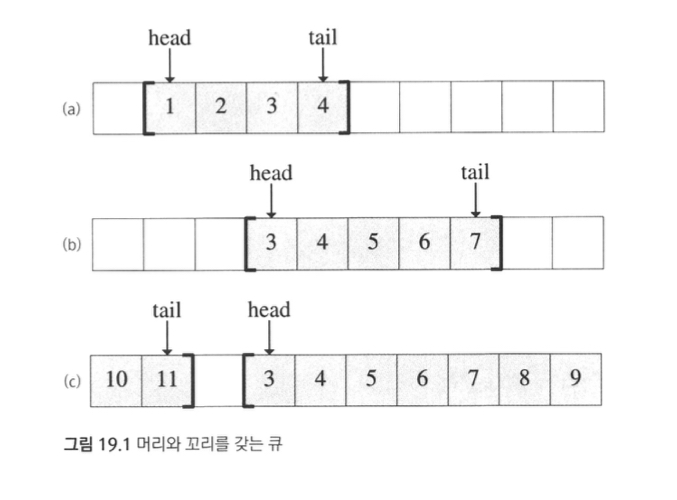

## 들어가며

우리는 알고리즘 문제를 풀며, 업무적으로 대화를 하며 큐, 스택, 데크라는 용어를 사용합니다.
해당 구조를 사용한다는 것은 자료들을 특정한 순서로 넣고, 꺼내는 것을 의미합니다. 또한 단순히 연결리스트나 배열을 이용해서 구현할 수도 있습니다.
그럼에도 불구하고 우리가 이름을 붙이고 사용한다는 것은 우리가 흔히 사용하고, 문제를 풀때, 업무를 진행할 때 개발자간의 대화를 효율적으로 만들어주기 때문입니다.  

위 글은 [알고리즘 문제해결전략(종만북)](https://book.algospot.com/),  [네이버블로그 - Python, module queue](https://m.blog.naver.com/PostView.nhn?blogId=dudwo567890&logNo=130165707606&proxyReferer=https:%2F%2Fwww.google.com%2F), [알고스팟 - BRACKETS2](https://www.algospot.com/judge/problem/read/BRACKETS2), [파이썬 설명서 - queue](https://docs.python.org/ko/3/library/queue.html), [파이썬 설명서 - collections.deque](https://docs.python.org/ko/3/library/collections.html#collections.deque) 를 참고했습니다.

## 큐(Queue), 스택(Stack), 데크(Deque)

세가지 모두 일렬로 늘어선 같은 형태의 자료들을 저장합니다. 이때 세 자료를 구분하는 것은 어느 쪽 끝에서 자료를 넣고 빼느냐입니다.

- 큐
  - FIFO(First In First Out), 선입선출
  - 한쪽 끝에서 자료를 넣고, 반대 쪽 끝에서 자료를 꺼냄
  - 놀이공원이나 음심적에서 선 줄
  - https://yongdanielliang.github.io/animation/web/Queue.html
- 스택
  - LIFO(Last In First Out), 후입선출
  - 한쪽 끝에서만 자료를 넣고 뺌
  - 함수의 호출은 바로 이전 함수로 돌아가야 함
- 데크
  - 큐와 스택의 일반화
  - 양쪽 끝에서 자료를 넣고 뺄 수 있음
  - 데크로 스택과 큐 모두 구현 가능

### 기능

- Push
  - 데이터를 넣는 작업
  - 큐에서는 Enqueue 라고도 함
- Pop
  - 데이터를 빼는 작업
  - 큐에서는 Dequeue 라고도 함
- 두가지 작업 모두 상수시간, O(1)로 이루어져야 함

### 큐와 스택, 데크의 구현

- 연결리스트
  - Head, Tail이 있고 필요한 곳에서 데이터를 넣거나 뺌
  - https://visualgo.net/en/list
- 동적 배열
  - 첫번째 원소와 마지막 원소의 위치를 head, tail에 저장
  - 원소를 넣거나 뺄 때 head와 tail에서 위치 정보 기록
  - 

## 파이썬에서 사용하기

```python
import queue
from queue import LifoQueue
from queue import Queue
from collections import deque
```

### 스택(Stack)

1. list

2. queue.LifoQueue

3. collections.deque  

   세가지로 파이썬에서 스택을 사용할 수 있습니다.

#### List

```python
# List
stack = []
print('list_push() ->', end=' ')
for i in range(5):
    stack.append(i)
    print(i, end=' ')

print()
print('list_pop() ->', end=' ')
while True:
    try:
        print(stack.pop(), end=' ')
    except IndexError:
        print()
        break
# list_push() -> 0 1 2 3 4 
# list_pop() -> 4 3 2 1 0 
```

* append method로 push를, pop method로 pop을 합니다.

#### queue.LifoQueue

```python
# queue.LifoQueue
stack = LifoQueue()
print('LifoQueue_push() ->', end=' ')
for i in range(5):
    stack.put(i)
    print(i, end=' ')

print()
print('LifoQueue_pop() ->', end=' ')
while True:
    try:
        # print(stack.get(), end=' ')
        print(stack.get_nowait(), end=' ')
    except queue.Empty:
        print()
        break
# LifoQueue_push() -> 0 1 2 3 4 
# LifoQueue_pop() -> 4 3 2 1 0 
```

* put method로 push를, get / get_nowait method로 pop을 합니다.
* queue 라이브러리 특성상 데이터가 들어올 때 까지 기다리는데, 그 경우를 피하기 위해서 위에서는 get_nowait method를 사용했습니다.

#### collections.deque

```python
# collections.deque
stack = deque([])
print('deque_push() ->', end=' ')
for i in range(5):
    stack.append(i)
    print(i, end=' ')

print()
print('deque_pop() ->', end=' ')
while True:
    try:
        print(stack.pop(), end=' ')
    except IndexError:
        print()
        break
# deque_push() -> 0 1 2 3 4 
# deque_pop() -> 4 3 2 1 0 
```

* deque 라이브러리에서는 원하는 방향에서 데이터를 넣고, 뺄 수 있습니다.

### 큐(Queue)

1. queue.Queue
2. collections.deque

큐 라이브러리를 잘 정리한 표가 있어 [[네이버블로그 - Python, module queue](https://m.blog.naver.com/PostView.nhn?blogId=dudwo567890&logNo=130165707606&proxyReferer=https:%2F%2Fwww.google.com%2F)\] 에서 가져왔습니다. List로 큐를 사용하지 않는 이유는 pop(0) 메서드는 매우 비효율적이기 때문입니다.

|                       클래스 |                                                         내용 |
| ---------------------------: | -----------------------------------------------------------: |
|         queue.Queue(maxsize) |             선입선출(FIFO First-In, First-Out)큐 객체를 생성 |
|     queue.LifoQueue(maxsize) | 일반적으로 스택(Stack)이라 불리는 후입선출(LIFO Last-In, First-Out)큐 객체를 생성 |
| queue.PriorityQueue(maxsize) | 우선순위 큐 객체를 생성입력되는 아이템의 형식은 (순위, 아이템)의 튜플로 입력되며,우선순위는 숫자가 작을수록 높은 순위를 갖는다. |

|                        메서드 |                                                         내용 |
| ----------------------------: | -----------------------------------------------------------: |
|                       qsize() |                        큐 객체에 입력된 아이템의 개수를 반환 |
| put(item[, block[, timeout]]) |                                 큐 객체에 아이템을 입력한다. |
|              put_nowait(item) | 블로킹(blocking)없이 큐 객체에 아이템을 입력한다.큐 객체가 꽉 차 있는 경우에는 queue.Full예외 발생 |
|       get([block[, timeout]]) |              생성된 큐 객체 특성에 맞추어, 아이템 1개를 반환 |
|                  get_nowait() | 블로킹(blocking)없이 큐 객체에 들어있는 아이템을 반환큐 객체에 아이템이 없는 경우에는 queue.Empty 예외 발생 |

|        예외 |                                 내용 |
| ----------: | -----------------------------------: |
| queue.Empty |    큐 객체에 아이템이 없는 경우 발생 |
|  queue.Full | 큐 객체에 아이템이 꽉 찬 경우에 발생 |

#### queue.Queue

```python
# queue.Queue
q = Queue()
print('Queue_push() ->', end=' ')
for i in range(5):
    q.put(i)
    print(i, end=' ')

print()
print('Queue_pop() ->', end=' ')
while True:
    try:
        # print(q.get(), end=' ')
        print(q.get_nowait(), end=' ')
    except queue.Empty:
        print()
        break
# Queue_push() -> 0 1 2 3 4 
# Queue_pop() -> 0 1 2 3 4 
```

#### collections.deque

```python
# collections.deque
q = deque([])
print('deque_push() ->', end=' ')
for i in range(5):
    q.append(i)
    print(i, end=' ')

print()
print('deque_pop() ->', end=' ')
while True:
    try:
        print(q.popleft(), end=' ')
    except IndexError:
        print()
        break
# deque_push() -> 0 1 2 3 4 
# deque_pop() -> 0 1 2 3 4 
```

### 덱(Deque)

덱은 스택과 큐를 일반화한 것입니다. 파이썬에서 일반적으로 사용하는 `list`와 매우 유사하지만, pop(0) 대신 popleft() 로 첫번째 값을 가져올 수 있습니다. `list`는 첫번째 값을 처리하고나서 나머지 모든 값의 인덱스를 조정하느라 느리지만, 덱 라이브러리는 그러한 부분을 해결했습니다. 공식문서를 아래에서 인용합니다.

> Though [`list`](https://docs.python.org/ko/3/library/stdtypes.html#list) objects support similar operations, they are optimized for fast fixed-length operations and incur O(n) memory movement costs for `pop(0)` and `insert(0, v)` operations which change both the size and position of the underlying data representation.

#### collections.deque

- `append(x)`
  - 데이터를 오른쪽에 넣는 메서드
- `appendleft(x)`
  - 데이터를 왼쪽에 넣는 메서드
- `extend(iterable)`
  - iterable한(여러 개의) 데이터를 오른쪽에 순서대로 넣는 메서드
- `extendleft(iterable)`
  - iterable한(여러 개의) 데이터를 왼쪽으로 순서대로 넣는 메서드
- `pop()`
  - 오른쪽에서 데이터 꺼내는 메서드
- `popleft()`
  - 왼쪽에서 데이터를 꺼내는 메서드

```python
deq = deque(['a', 'b', 'c'])

print('deq: {}\n'.format(deq))
# deq: deque(['a', 'b', 'c'])

print('append method - d')
print('-------------------------------')
print('before: {}'.format(deq))
deq.append('d')
print('after: {}\n'.format(deq))
# append method - d
# -------------------------------
# before: deque(['a', 'b', 'c'])
# after: deque(['a', 'b', 'c', 'd'])

print('appendleft method - e')
print('-------------------------------')
print('before: {}'.format(deq))
deq.appendleft('e')
print('after: {}\n'.format(deq))
# appendleft method - e
# -------------------------------
# before: deque(['a', 'b', 'c', 'd'])
# after: deque(['e', 'a', 'b', 'c', 'd'])

print('extend method - python')
print('-------------------------------')
print('before: {}'.format(deq))
deq.extend('python')
print('after: {}\n'.format(deq))
# extend method - python
# -------------------------------
# before: deque(['e', 'a', 'b', 'c', 'd'])
# after: deque(['e', 'a', 'b', 'c', 'd', 'p', 'y', 't', 'h', 'o', 'n'])

print('extendleft method - algorithm')
print('-------------------------------')
print('before: {}'.format(deq))
deq.extendleft('algorithm')
print('after: {}\n'.format(deq))
# extendleft method - algorithm
# -------------------------------
# before: deque(['e', 'a', 'b', 'c', 'd', 'p', 'y', 't', 'h', 'o', 'n'])
# after: deque(['m', 'h', 't', 'i', 'r', 'o', 'g', 'l', 'a', 'e', 'a', 'b', 'c', 'd', 'p', 'y', 't', 'h', 'o', 'n'])

print('pop method: {}\n'.format(deq.pop()))
# pop method: n

print('popleft method: {}'.format(deq.popleft()))
# popleft method: m

```


## 문제: 짝이 맞지 않는 괄호

[알고스팟에 올라온 문제 - 짝이 맞지 않는 괄호](https://www.algospot.com/judge/problem/read/BRACKETS2)입니다. 아래의 조건을 만족해야 합니다. 입력으로 테스트케이스 C가 주어지고 아래 각 C 줄에 해당하는 문자열이 들어옵니다. 올바른 괄호에는 YES를, 아닌 경우에는 NO를 답합니다.

- 둥근괄호 - `(`, `)`
- 중괄호 - `{`, `}`
- 대괄호 - `[`, `]`
- 모든 괄호는 해당하는 짝이 있어야 합니다.
- 모든 괄호 쌍은 먼저 열린 뒤 답힙니다.
- 한 괄호 쌍이 다른 괄호쌍과 서로 '교차해'있으면 안됩니다. 이 정의에 의하면 `{(})`는 짝이 맞지 않는 경우입니다.

### 예제 입/출력

```
예제 입력

3
()()
({[}])
({}[(){}])
```

```
예제 출력

YES
NO
YES
```

### 테스트 케이스

```python
# 세가지 케이스
q1 = '()()'
q2 = '({[}])'
q3 = '({}[(){}])'
```

#### 라이브러리 및 필요 딕셔너리 선언

```python
from collections import deque


is_opener = {
    '{': 1,
    '[': 1,
    '(': 1,
    '}': 0,
    ']': 0,
    ')': 0
}
bracket_to_be_pair = {
    ']': '[',
    ')': '(',
    '}': '{'
}
```

#### List를 활용한 일반적인 풀이

```python
def solution(problem):
    if not problem:
        return 'YES'
    stack = []
    for i, c in enumerate(problem):
        if is_opener[c]:
            stack.append(c)
        else:
            if not stack:
                return 'NO'
            if bracket_to_be_pair[c] == stack.pop():
                continue
            else:
                return 'NO'
    if stack:
        return 'NO'
    else:
        return 'YES'

    
print(solution(q1))
print(solution(q2))
print(solution(q3))
# YES
# NO
# YES
```

#### List와 try/except 를 활용한 풀이

```python
def solution(problem):
    try:
        stack = []
        for c in problem:
            if check[c]:
                stack.append(c)
            else:
                assert check_pair[c] == stack.pop()
        if stack:
            return 'NO'
        else:
            return 'YES'
    except:
        return 'NO'
    

print(solution(q1))
print(solution(q2))
print(solution(q3))
# YES
# NO
# YES
```

#### deque 라이브러리와 try/except를 활용한 풀이

```python
def solution(problem):
    try:
        stack = deque([])
        for c in problem:
            if check[c]:
                stack.append(c)
            else:
                assert check_pair[c] == stack.pop()
        if stack:
            return 'NO'
        else:
            return 'YES'
    except:
        return 'NO'
    
    
print(solution(q1))
print(solution(q2))
print(solution(q3))
# YES
# NO
# YES
```

* 사실 스택을 사용한 것이기에, 덱을 사용할 필요는 없습니다.