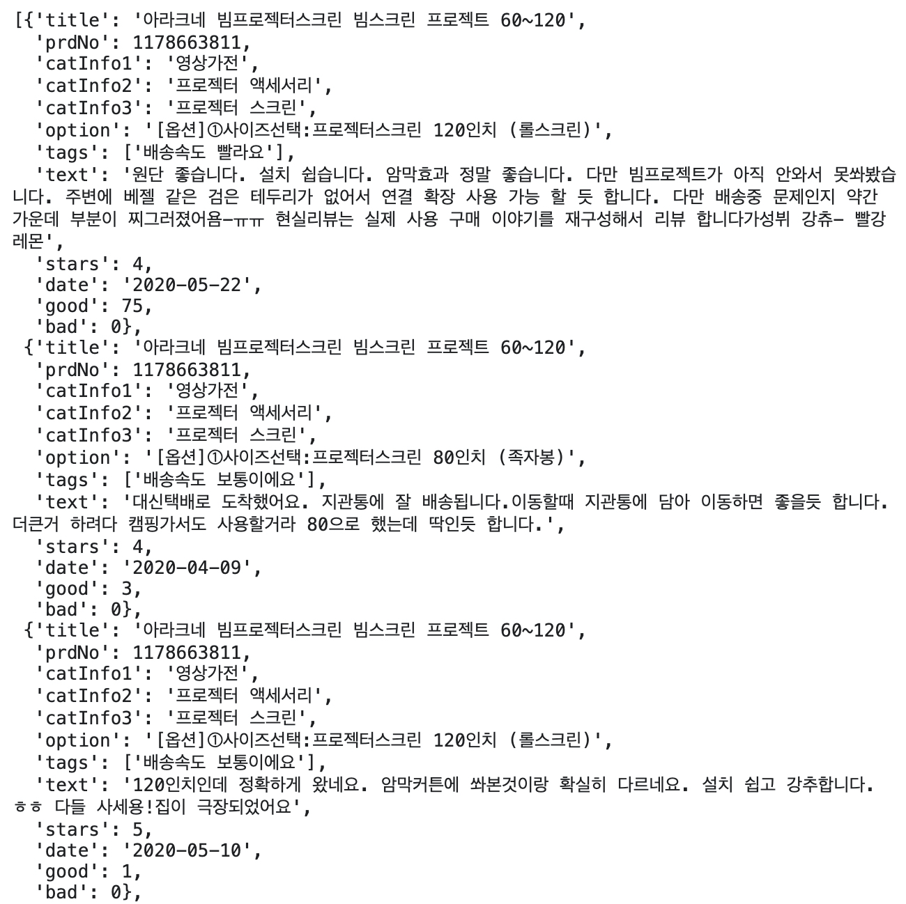
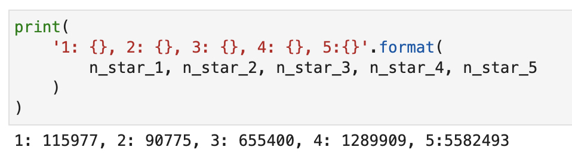
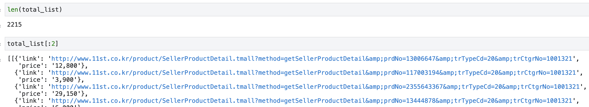

## 시작하며

이번 글에서는 11번가에서 상품에 대한 리뷰 텍스트 데이터와 그 상품에 대한 평점을 긁은 크롤링 작업 과정을 담고 있습니다. 참고로, 홈페이지에 존재하는 (거의) 모든 데이터를 긁는 것이 목표였습니다. (ㅎㅎ 거창하죠?) 코드 작성의 사고 흐름과 문제 해결 과정에 대해 이야기 할까 합니다.

### 기대 독자

1. 기본적인 HTML 구조와 CSS 문법에 대해 알면 좋습니다. 아래를 참고하시면 좋습니다.
   1. [CSS Selector Reference](https://www.w3schools.com/cssref/css_selectors.asp)
2. `BeautifulSoup` 과 `Selenium` 을 이용하여 페이지내 필요한 요소를 뽑아 낼 수 있으면 좋습니다.
   1. [Beautiful Soup Documentation](https://www.crummy.com/software/BeautifulSoup/bs4/doc/)
   2. [WebDriver를 사용하여 페이지 요소 찾기]([https://riptutorial.com/ko/selenium-webdriver/example/13934/webdriver%EB%A5%BC-%EC%82%AC%EC%9A%A9%ED%95%98%EC%97%AC-%ED%8E%98%EC%9D%B4%EC%A7%80-%EC%9A%94%EC%86%8C-%EC%B0%BE%EA%B8%B0](https://riptutorial.com/ko/selenium-webdriver/example/13934/webdriver를-사용하여-페이지-요소-찾기))
3. 크롤링 과정을 한번 살펴보고 싶은 사람
4. 심심한 사람


## 크롤링의 전체적인 과정과 최종 산출물

크롤링을 어떤 과정으로 진행했는지, 그리고 제가 뽑고자 했던 데이터가 구체적으로 무엇인지 결과 아웃풋의 일부를 보여드릴게요.

### 전체적인 과정 흐름

1. 현재의 페이지에서 필요한 데이터를 전부 긁어옵니다.
2. 다음 페이지가 있으면 다음 페이지로 넘어갑니다.
3. 끝 페이지이고, 다음 섹션이 있으면 다음 섹션으로 넘어갑니다.
4. 위 과정을 반복합니다.
5. 해당 URL에서 위 과정을 끝냈으면 다음 URL으로 넘어갑니다.

> 

### 최종 산출물

아래의 항목들을 수집했습니다.

* 제품명
* 제품 번호
* 카테고리 정보
* 구매 옵션
* 리뷰 텍스트
* 별점
* 태그
* 작성 날짜
* 좋아요 갯수
* 싫어요 갯수

> 

데이터는 지금까지 약 770만여개가 수집되었고, 별점 기준으로 봤을때 각각의 갯수는 아래와 같네요.

> 

## 크롤링 과정과 파이썬 코드


### 0. 크롤링 준비

먼저 필요한 라이브러리와 웹드라이버를 준비합니다. 예시에서는 [싸이닉, 내게 딱 맞는 썬! 골라보썬!](http://www.11st.co.kr/product/SellerProductDetail.tmall?method=getSellerProductDetail&prdNo=1242750805&trTypeCd=21&trCtgrNo=1002065) 제품 url을 사용합니다. 해당 url로 접속합니다.

```python
import time
import requests
from typing import List, Tuple
import pickle
from json import dump

from bs4 import BeautifulSoup
from selenium import webdriver
from selenium.webdriver.support.ui import WebDriverWait
from selenium.webdriver.support import expected_conditions as EC
from selenium.webdriver.common.by import By
from selenium.common.exceptions import NoSuchElementException


chrome_driver_path = '/Users/henris/chromedriver'  
driver = webdriver.Chrome(chrome_driver_path)
url = 'http://www.11st.co.kr/product/SellerProductDetail.tmall?method=getSellerProductDetail&prdNo=1242750805&trTypeCd=21&trCtgrNo=1002065'

driver.get(url)
WebDriverWait(driver, 10).until(EC.presence_of_element_located((By.ID, 'ifrmReview')))
```

### 1. 현재 페이지의 기초 데이터(제품명, 카테고리)

`driver` 로 접근해 제품명과 카테고리를 가져옵니다.

```python
def get_title(driver) -> str:
    soup = BeautifulSoup(driver.page_source)
    
    title = soup.select_one('h2').get_text()
    return title.strip()


def get_cat_info(driver) -> Tuple[str, str, str]:
    soup = BeautifulSoup(driver.page_source)
    
    cat_info_1 = soup.select_one('#headSel_1').get_text()
    cat_info_2 = soup.select_one('#headSel_2').get_text()
    cat_info_3 = soup.select_one('#headSel_3').get_text()
    return cat_info_1.strip(), cat_info_2.strip(), cat_info_3.strip()


title = get_title(driver)
cat_info_1, cat_info_2, cat_info_3 = get_cat_info(driver)
```


### 2. 현재 페이지의 리뷰 데이터 긁기

사실 CSS Selector나 HTML 문법으로 리뷰 데이터에 바로 접근이 되지 않습니다. 리뷰 섹션은 아이프레임 구조로 이루어져있기 때문인데요.(삽질의 원인... 🤣) 따라서 바꿔주는 작업이 필요합니다.

```python
# review section is iframe structure, need to change
driver.switch_to.frame("ifrmReview")
WebDriverWait(driver, 10).until(EC.presence_of_element_located((By.CLASS_NAME, 'ifrm_prdc_review')))
```

이제 마음껏 파싱할 수 있습니다 :) 

```python
def get_html_with_bs(driver) -> BeautifulSoup:
    soup = BeautifulSoup(driver.page_source)
    return soup

  
def list_review_on_this_page(soup) -> BeautifulSoup:
    return soup.find('div', class_='review_list').find_all('li')
  
  
# whole review information from this page
soup_on_this_page = get_html_with_bs(driver)
reviews_on_this_page = list_review_on_this_page(soup_on_this_page)
```

이제 해당 한 페이지의 리뷰 데이터를 얻기 위한 함수들을 정의합니다. 태그, 텍스트, 별점 등의 정보를 가져와야겠죠?

```python
def get_review_info(soup) -> BeautifulSoup:
    return soup.find('a', class_='reviewDetail')


def link_to_review_detail_page(
    contMapNo, prdNo, contNo
) -> BeautifulSoup:
    review_page = REVIEW_PAGE_FMT.format(
        contMapNo=contMapNo, prdNo=prdNo, contNo=contNo
    )
    resp = requests.get(review_page)
    soup = BeautifulSoup(resp.text)
    return soup


def get_tags_of_review(soup) -> List[str]:
    return [
        tag.get_text()
        for tag in soup.find_all('span', class_='re_ico')
    ]


def get_text_of_review(soup) -> str:
    text = soup.find('div', class_='bbs_cont_wrap').get_text()
    text = text.replace(STUPID_TEXT_1, '')
    text = text.replace(STUPID_TEXT_2, '')
    text = text.replace(STUPID_TEXT_3, '')
    text = text.replace(STUPID_TEXT_4, '')
    return text.strip()


def get_stars_of_review(soup) -> int:
    return int(
        soup.find('span', class_='selr_star').get_text()[-2]
    )

def get_option_of_review(soup) -> str:
    return soup.select_one('p.option_txt').get_text().strip()


def get_date_of_review(soup) -> str:
    return soup.select_one('span.date').get_text().strip()


def get_good_and_bad_of_review(soup) -> Tuple[int, int]:
    good = soup.select_one('a.good span.cnt').get_text().strip()
    bad = soup.select_one('a.bad span.cnt').get_text().strip()
    return int(good), int(bad)


REVIEW_PAGE_FMT = \
'http://deal.11st.co.kr/product/SellerProductDetail.tmall?method=\
getProductReviewDetailv2&contMapNo={contMapNo}&prdNo={prdNo}&contNo={contNo}'

STUPID_TEXT_1 = '인터넷 익스플로러 하위버전을 사용하고 있어 동영상이 노출이 되고 있지 않습니다.'
STUPID_TEXT_2 = '최선버전을 다운로드해주세요.'
STUPID_TEXT_3 = '익스플로러 다운로드바로가기'
STUPID_TEXT_4 = '동영상재생'
```

태그 정보를 가지고 오는 것은 사진을 첨부한 detailed review만 가능합니다. 저는 태그도 가지고 오기 위해 사진을 첨부하지 않은 글만 존재하는 리뷰는 제외했습니다.

```python
# get information to link a review detail page
review_info = get_review_info(review_on_this_page)
if not review_info:
    continue
contMapNo = review_info['data-contmapno']
prdNo = review_info['data-prdno']
contNo = review_info['data-contno']

review_detail_page = link_to_review_detail_page(
    contMapNo=contMapNo, prdNo=prdNo, contNo=contNo
)

# extract information from the review detail page
tags = get_tags_of_review(review_detail_page)
text = get_text_of_review(review_detail_page)
stars = get_stars_of_review(review_detail_page)
option = get_option_of_review(review_detail_page)
date = get_date_of_review(review_detail_page)
good, bad = get_good_and_bad_of_review(review_detail_page)

# save specific review information
if text:
    reviews.append(
        {
            'title': title,
            'prdNo': prdNo,
            'catInfo1': cat_info_1,
            'catInfo2': cat_info_2,
            'catInfo3': cat_info_3,
            'option': option,
            'tags': tags,
            'text': text,
            'stars': stars,
            'date': date,
            'good': good,
            'bad': bad,
        }
    )

print('현재 {}번 page 크롤링이 완료되었습니다.'.format(page_num))
```


### 3. 다음 페이지가 있으면 다음 페이지로 넘어가기

`try/except` 구문을 활용하여 다음페이지로 넘어갑니다.

```python
def go_to_next_page(driver, page_num) -> None:
  next_page = driver.find_element_by_css_selector('div.review_list strong ~ #paging_page')
  next_page.click()


# go to next page (ex: 1->2 or 16->17)
try:
    go_to_next_page(driver, page_num)
    print('다음 page로 넘어가는 중입니다.....\n')
    page_num += 1
    continue      
except NoSuchElementException:
    print('이번 section에서는 마지막 page 입니다.')
```


### 4. 끝 페이지이고, 다음 섹션이 있으면 다음 섹션으로 넘어가기

끝 페이지(ex 10번 페이지, 30번 페이지) 였다면 3번의 except 에 걸리게 되고, 다음 섹션으로 넘어가는 구문이 실행됩니다.

```python
def go_to_next_section(driver) -> None:
    next_section = driver.find_element_by_css_selector('.review_list #paging_next')
    next_section.click()
    
    
# go to next section (ex: 10->11 or 30->31)
try:
    go_to_next_section(driver)
    print('다음 section으로 넘어가는 중입니다.....\n')
    page_num += 1
except NoSuchElementException:
    print('이것으로 크롤링을 종료합니다.')
    break
```


### 5. URL 정보 모아오기

이제 한 제품의 모든 리뷰 데이터를 가져오는 작업까지 끝났습니다. 여기서 완전 자동화를 이루기 위해서는 URL 정보가 무수히 있어야 합니다.  

URL 정보를 얻기 위해서는 약간의 잔머리가 필요합니다. 카테고리로 접근하여 데이터를 얻은 경우 URL 포맷이 아래의 경우와 같았습니다. 또한 어떤 숫자의 경우는 100 으로 시작하는 7자리의 숫자더군요.

> http://www.11st.co.kr/category/DisplayCategory.tmall?method=getDisplayCategory2Depth&&dispCtgrNo={어떤 숫자}#sortCd%%I$$pageNum%%1

그럼 우리는 위 URL에 7자리 숫자를 넣어 카테고리 페이지를 확인해보고, 데이터가 존재하면 거기서 리뷰 많은 순으로 링크 URL을 가져와보죠!

```python
driver = webdriver.Chrome(chrome_driver_path)
URL_FMT = 'http://www.11st.co.kr/category/DisplayCategory.tmall?method=getDisplayCategory2Depth&&dispCtgrNo={CtgrNo}#sortCd%%I$$pageNum%%1'

ctgr_no = 1001301
total_list = []

while True:
    driver.get(URL_FMT.format(CtgrNo=ctgr_no))
    try:
        WebDriverWait(driver, 2).until(EC.presence_of_element_located((By.CSS_SELECTOR, '#product_listing .total_listing_wrap')))
        
    except Exception as e:
        ctgr_no = ctgr_no - (ctgr_no % 10) + 11
        continue
    keywords = driver.find_element_by_css_selector('meta[name=keywords]').get_attribute('content')
    this_page_soup = BeautifulSoup(driver.page_source)
    item_soup_list = this_page_soup.select('#product_listing .total_listitem')
    print(len(item_soup_list))
    this_keyword_value = []
    for item_soup in item_soup_list:
        price = item_soup.select_one('.sale_price').get_text()
        link = item_soup.select_one('a[href]')['href']
        this_keyword_value.append(
            {
                'link': link,
                'price': price
            }
        )
    total_list.append(this_keyword_value)
    ctgr_no += 1
    
    if ctgr_no > 2000000:
        break
    
with open('list_11st_link.pkl', 'wb') as f:
    pickle.dump(total_list, f)
```

>  

링크가 많이 쌓였네요 :) 

## 크롤링 자동화 파이썬 코드

위 과정을 묶어서 데이터를 계속 수집하는 코드를 작성하며 글을 마무리합니다.

```python
import time
import requests
from typing import List, Tuple
import pickle
from json import dump

from bs4 import BeautifulSoup
from selenium import webdriver
from selenium.webdriver.support.ui import WebDriverWait
from selenium.webdriver.support import expected_conditions as EC
from selenium.webdriver.common.by import By
from selenium.common.exceptions import NoSuchElementException


def get_cat_info(driver) -> Tuple[str, str, str]:
    soup = BeautifulSoup(driver.page_source)
    
    cat_info_1 = soup.select_one('#headSel_1').get_text()
    cat_info_2 = soup.select_one('#headSel_2').get_text()
    cat_info_3 = soup.select_one('#headSel_3').get_text()
    return cat_info_1.strip(), cat_info_2.strip(), cat_info_3.strip()


def get_title(driver) -> str:
    soup = BeautifulSoup(driver.page_source)
    
    title = soup.select_one('h2').get_text()
    return title.strip()


def go_to_next_section(driver) -> None:
    next_section = driver.find_element_by_css_selector('.review_list #paging_next')
    next_section.click()


def go_to_next_page(driver, page_num) -> None:
    next_page = driver.find_element_by_css_selector('div.review_list strong ~ #paging_page')
    next_page.click()


def get_html_with_bs(driver) -> BeautifulSoup:
    soup = BeautifulSoup(driver.page_source)
    return soup


def list_review_on_this_page(soup) -> BeautifulSoup:
    return soup.find('div', class_='review_list').find_all('li')


def get_review_info(soup) -> BeautifulSoup:
    return soup.find('a', class_='reviewDetail')


def link_to_review_detail_page(
    contMapNo, prdNo, contNo
) -> BeautifulSoup:
    review_page = REVIEW_PAGE_FMT.format(
        contMapNo=contMapNo, prdNo=prdNo, contNo=contNo
    )
    resp = requests.get(review_page)
    soup = BeautifulSoup(resp.text)
    return soup


def get_tags_of_review(soup) -> List[str]:
    return [
        tag.get_text()
        for tag in soup.find_all('span', class_='re_ico')
    ]


def get_text_of_review(soup) -> str:
    text = soup.find('div', class_='bbs_cont_wrap').get_text()
    text = text.replace(STUPID_TEXT_1, '')
    text = text.replace(STUPID_TEXT_2, '')
    text = text.replace(STUPID_TEXT_3, '')
    text = text.replace(STUPID_TEXT_4, '')
    return text.strip()


def get_stars_of_review(soup) -> int:
    return int(
        soup.find('span', class_='selr_star').get_text()[-2]
    )

def get_option_of_review(soup) -> str:
    return soup.select_one('p.option_txt').get_text().strip()


def get_date_of_review(soup) -> str:
    return soup.select_one('span.date').get_text().strip()


def get_good_and_bad_of_review(soup) -> Tuple[int, int]:
    good = soup.select_one('a.good span.cnt').get_text().strip()
    bad = soup.select_one('a.bad span.cnt').get_text().strip()
    return int(good), int(bad)


REVIEW_PAGE_FMT = \
'http://deal.11st.co.kr/product/SellerProductDetail.tmall?method=\
getProductReviewDetailv2&contMapNo={contMapNo}&prdNo={prdNo}&contNo={contNo}'

STUPID_TEXT_1 = '인터넷 익스플로러 하위버전을 사용하고 있어 동영상이 노출이 되고 있지 않습니다.'
STUPID_TEXT_2 = '최선버전을 다운로드해주세요.'
STUPID_TEXT_3 = '익스플로러 다운로드바로가기'
STUPID_TEXT_4 = '동영상재생'


chrome_driver_path = '/Users/henris/chromedriver'
driver = webdriver.Chrome(chrome_driver_path)

with open('list_11st_link.pkl', 'rb') as f:
    cat_url_list = pickle.load(f)
    
json_no = 0

for cat in cat_url_list:
    for info in cat:
        url = info['link']
        try:
            driver.get(url)
            WebDriverWait(driver, 10).until(EC.presence_of_element_located((By.ID, 'ifrmReview')))
            title = get_title(driver)
            cat_info_1, cat_info_2, cat_info_3 = get_cat_info(driver)

            # review section is iframe structure, need to change
            driver.switch_to.frame("ifrmReview")
            WebDriverWait(driver, 10).until(EC.presence_of_element_located((By.CLASS_NAME, 'ifrm_prdc_review')))

            reviews = []

            page_num = 1

            while True:

                print('현재 {}번 page를 크롤링합니다.'.format(page_num))

                # whole review information from this page
                soup_on_this_page = get_html_with_bs(driver)
                reviews_on_this_page = list_review_on_this_page(soup_on_this_page)

                for review_on_this_page in reviews_on_this_page:    
                    # get information to link a review detail page
                    review_info = get_review_info(review_on_this_page)
                    if not review_info:
                        print('해당 리뷰는 정보가 부족하므로 넘어갑니다.')
                        continue
                    contMapNo = review_info['data-contmapno']
                    prdNo = review_info['data-prdno']
                    contNo = review_info['data-contno']

                    review_detail_page = link_to_review_detail_page(
                        contMapNo=contMapNo, prdNo=prdNo, contNo=contNo
                    )

                    # extract information from the review detail page
                    tags = get_tags_of_review(review_detail_page)
                    text = get_text_of_review(review_detail_page)
                    stars = get_stars_of_review(review_detail_page)
                    option = get_option_of_review(review_detail_page)
                    date = get_date_of_review(review_detail_page)
                    good, bad = get_good_and_bad_of_review(review_detail_page)

                    # save specific review information
                    if text:
                        reviews.append(
                            {
                                'title': title,
                                'prdNo': prdNo,
                                'catInfo1': cat_info_1,
                                'catInfo2': cat_info_2,
                                'catInfo3': cat_info_3,
                                'option': option,
                                'tags': tags,
                                'text': text,
                                'stars': stars,
                                'date': date,
                                'good': good,
                                'bad': bad,
                            }
                        )

                print('현재 {}번 page 크롤링이 완료되었습니다.'.format(page_num))

                # go to next page (ex: 1->2 or 16->17)
                try:
                    # 제대로 넘어가지 않은 경우 wait 구현 필요
                    go_to_next_page(driver, page_num)
                    print('다음 page로 넘어가는 중입니다.....\n')
                    page_num += 1
                    continue      
                except NoSuchElementException:
                    print('이번 section에서는 마지막 page 입니다.')

                # go to next section (ex: 10->11 or 30->31)
                try:
                    go_to_next_section(driver)
                    print('다음 section으로 넘어가는 중입니다.....\n')
                    page_num += 1
                except NoSuchElementException:
                    print('이것으로 크롤링을 종료합니다.')
                    break

            with open('{}.txt'.format(json_no), 'w') as f:
                dump(reviews, f)reviews
            json_no += 1

        except:
            print('에러가 발생했습니다. url - {}'.format(url))
            continue
```


