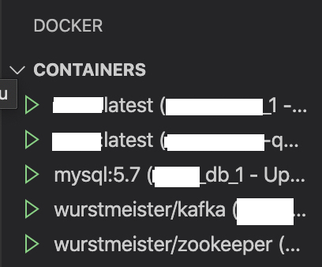

안녕하세요. 오늘은 도커 컨테이너에서 GPU 관련 업무를 진행할 수 있도록 __cuda 10.2__ 와 __cudnn__ 이 설치된 컨테이너를 실행하는 방법에 대해 알아보도록 하겠습니다. 해당 글은 [여기](https://github.com/NVIDIA/nvidia-docker) 와 [여기](https://hub.docker.com/r/nvidia/cuda/tags) 그리고 [여기](https://docs.nvidia.com/dgx/nvidia-container-runtime-upgrade/index.html#:~:text=Use%20docker%20run%20with%20nvidia,file%20as%20the%20first%20entry.&text=You%20can%20then%20use%20docker%20run%20to%20run%20GPU%2Daccelerated%20containers) 를 참고했음을 알립니다. 이번에도 여러분의 삽질에 도움이 되기를 바랍니다!

### 예상독자

위 글을 읽는 독자는 아래 경험을 가지고 있다고 가정합니다. 또한, 작업하는 환경도 nvidia driver가 미리 설치되어 있다고 가정합니다.

* Docker 사용 경험
* Cuda를 설치하여 GPU를 활용한 네트워크 학습 경험

### nvidia 도커를 사용하여 GPU 사용이 가능한 컨테이너 실행

위 작업은 세가지로 이루어졌습니다.

1. nvidia-container-toolkit 설치
2. docker runtime 시 nvidia-docker를 default로 추가
3. GPU 학습이 가능한 이미지를 만드는 도커파일 작성
4. 도커파일 실행(이미지 빌드) 및 컨테이너 실행

#### 1. nvidia docker 설치
```shell
# On Ubuntu 16.04/18.04/20.04, Debian Jessie/Stretch/Buster
# Add the package repositories
$ distribution=$(. /etc/os-release;echo $ID$VERSION_ID)
$ curl -s -L https://nvidia.github.io/nvidia-docker/gpgkey | sudo apt-key add -
$ curl -s -L https://nvidia.github.io/nvidia-docker/$distribution/nvidia-docker.list | sudo tee /etc/apt/sources.list.d/nvidia-docker.list

$ sudo apt-get update && sudo apt-get install -y nvidia-container-toolkit
$ sudo systemctl restart docker
```
>[[nvidia-docker github](https://github.com/NVIDIA/nvidia-docker)]

* Host PC에 nvidia nvidia-container-toolkit을 설치
* 이 작업을 통해 Host에서 nvidia docker를 실행했을때, 컨테이너가 Host의 GPU를 인식 가능

#### 2. docker runtime시에 nvidia-docker를 default로 추가
```json
# on /etc/docker/daemon.json

{
 "default-runtime": "nvidia",
  "runtimes": {
     "nvidia": {
         "path": "/usr/bin/nvidia-container-runtime",
         "runtimeArgs": []
     }
 },

}
```
>[[nvidia document](https://docs.nvidia.com/dgx/nvidia-container-runtime-upgrade/index.html#:~:text=Use%20docker%20run%20with%20nvidia,file%20as%20the%20first%20entry.&text=You%20can%20then%20use%20docker%20run%20to%20run%20GPU%2Daccelerated%20containers)]

* docker runtime(도커 실행) 시 `nvidia` 를 기본으로 잡지 않음
* `nvidia` 를 잡지 않으면 `nvidia:cuda` 기반 이미지로 컨테이너를 실행해도 컨테이너는 GPU를 인식하지 못함
* `/etc/docker/daemon.json` 파일에 위 구문을 추가하면 docker 명령어 실행시 기본으로 `nvidia` 를 잡음
* 위 방법이 아니더라도 `docker run ~~ ` 명령어에서 추가하면 `nvidia` 를 잡을 수 있음
* 위처럼 default로 설정하면 [[docker SDK for python](https://docker-py.readthedocs.io/en/stable/)] 로 도커를 다루는 경우에도 대응이 쉬워짐

#### 3. GPU 학습이 가능한 이미지를 만드는 도커파일 작성
```dockerfile
FROM nvidia/cuda:10.2-cudnn7-devel-ubuntu18.04

# Install some basic utilities
RUN apt-get update && apt-get install -y \
    curl \
    ca-certificates \
    sudo \
    git \
    bzip2 \
    libx11-6 \
 && rm -rf /var/lib/apt/lists/*

# Set enviorments
WORKDIR /app
COPY ./ /app

# Install Miniconda and Python 3.7
ENV CONDA_AUTO_UPDATE_CONDA=false
ENV PATH=/root/miniconda//bin:$PATH
RUN curl -sLo ~/miniconda.sh https://repo.continuum.io/miniconda/Miniconda3-py37_4.8.3-Linux-x86_64.sh \
 && chmod +x ~/miniconda.sh \
 && ~/miniconda.sh -b -p ~/miniconda \
 && rm ~/miniconda.sh \
 && conda install -y python==3.7.3 \
 && conda clean -ya

RUN apt-get update
RUN apt-get install gcc python-dev python3-dev \
     build-essential libssl-dev libffi-dev \
     libxml2-dev libxslt1-dev zlib1g-dev \
     python-pip -y
```
>[[무수히 많은 nvidia:cuda 기반 이미지들](https://hub.docker.com/r/nvidia/cuda/tags)]

* 작성자의 경우 `cuda 10.2`, `cudnn7`, `ubuntu 18.04` 를 기반으로 하는 이미지를 활용
  * 기본은 cuda 11이었는데.. 주로 쓰는게 10.2이라 10.2를 씀. torch가 gpu를 쓰는듯 하긴 했음
* miniconda python 3.7 도 활용
* `requirements.txt` 를 활용하여 torch 등 라이브러리 설치 추천


#### 4. 도커파일 실행(이미지 빌드) 및 컨테이너 실행

> asdf

> asdf
* 터미널에서 `docker build --tag test:1.0.0.0 .` 와 같은 명령어로 이미지 빌드!

### Local VSCode에서 Remote Container에 attach!

이후에는 VSCode docker extension에서 원격의 container에 attach 할 수 있습니다.

>  