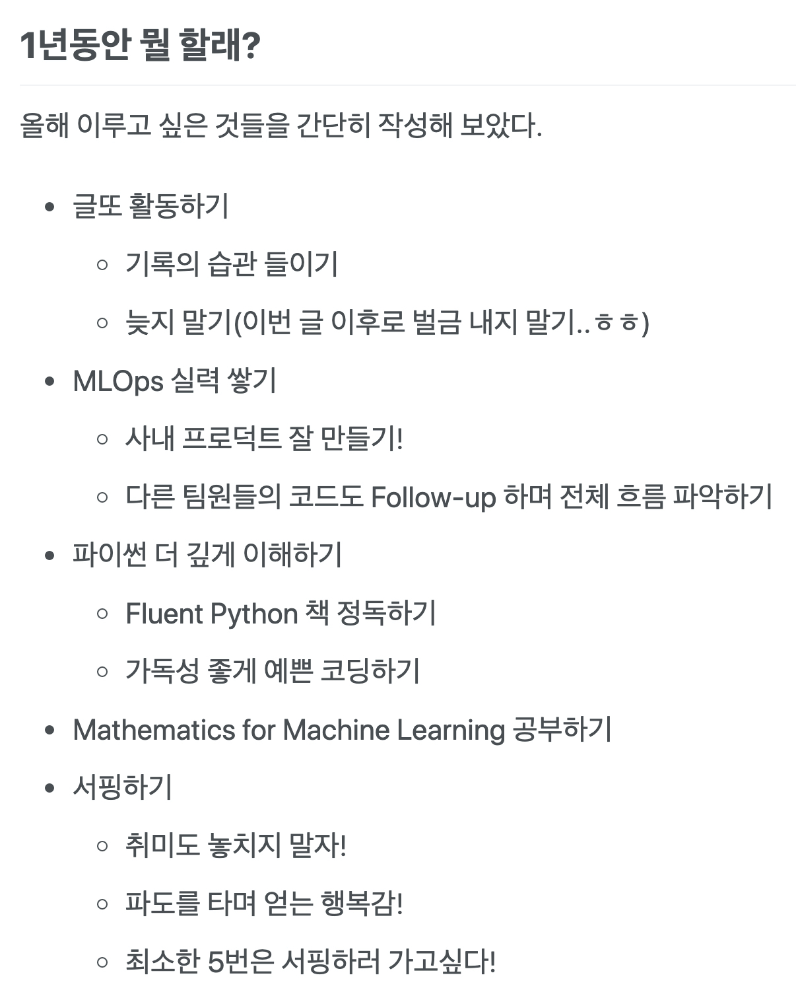

## 글또 4기 활동 마지막 글을 쓰며
벌써 [글또](https://www.notion.so/ac5b18a482fb4df497d4e8257ad4d516) 4기 활동중에 작성하는 마지막 글입니다. 올해 상반기는 정말 정말.. 시간이 많이 빠르다고 느꼈는데, 그처럼 글또 4기 활동도 벌써 끝나게 되었네요...! 처음 글또 다짐금을 쓴 이후로 한게 없는것처럼 느끼면서도, 또 한편으론 이것저것 한것이 느껴지기도 합니다 :) 오늘 글은 지난 글또 다짐글에서 작성했던 올해 목표를 살펴보고, 또 내가 업무와 글또 활동에서 무엇을 했는지, 다음에는 어떤 글을 쓸지, 마지막으로 느낀점을 이야기하도록 하겠습니다.
* 지난 1년 목표
* 내가 지금까지 무엇을 했는가?
  * 업무
  * 글또
* 다음에는 어떤글을 쓸 것인가
* 느낀점

## 지난 1년 목표
(나의 지난 날과 앞으로의 다짐)[https://hunhoon21.github.io/%EB%82%98%EC%9D%98-%EC%A7%80%EB%82%9C-%EB%82%A0%EA%B3%BC-%EC%95%9E%EC%9C%BC%EB%A1%9C%EC%9D%98-%EB%8B%A4%EC%A7%90/] 에서 목표로 했던 올해 목표는 아래와 같습니다.
> 
올해의 목표를 다시금 보니 제가 목표했던바를 얼마나 이루고 있는지 생각할 수 있어서 좋은것 같습니다. 개인적으로 서핑은 양양 서핑 캠프를 하면서 최소 5번이 아니라 10번 넘게 간것 같습니다ㅎㅎ 서핑이라는 취미를 즐길 수 있어서 좋았지만, 그만큼 주말에 공부를 하지 못한게 아쉽기도 하네요. 또, 9편의 글을 쓰며 글또 활동을 했지만 추가로 벌금을 낸 부분도 아쉽습니다. 아래에서 내가 지금까지 무엇을 했는지 살펴보며 올해의 목표를 얼마나 이루고 있는지 이야기하도록 하겠습니다.

## 내가 지금까지 무엇을 했는지
회사에서 산업 현장에 딥러닝 모델을 올리는 플랫폼 개발팀에 합류하면서, 현재는 자연스레 개발 쪽에 좀 더 초점을 두고 있습니다. 그래서 업무와 밀접한 MLOps 관련으로 경험을 많이 했습니다. 자연스럽게 파이썬도 점점 더 깊게 알게 되는것 같습니다. 반대로 제품 개발에 초점을 두다 보니 수학이나 딥러닝 최신 트렌드, 실험과는 거리가 있었던 상반기였네요.  
지난 1년 목표와 비교해서 확인해볼까요?
- [ x ] 글또 활동하기
- [ x ] MLOps 실력쌓기
- [ x ] 파이썬 더 깊게 이해하기
- [ ] Mathematics for Machine Learning 공부하기
- [ x ] 서핑하기

### 업무

### 글또

## 다음에 어떤글을 쓸 것인가

## 마지막으로
