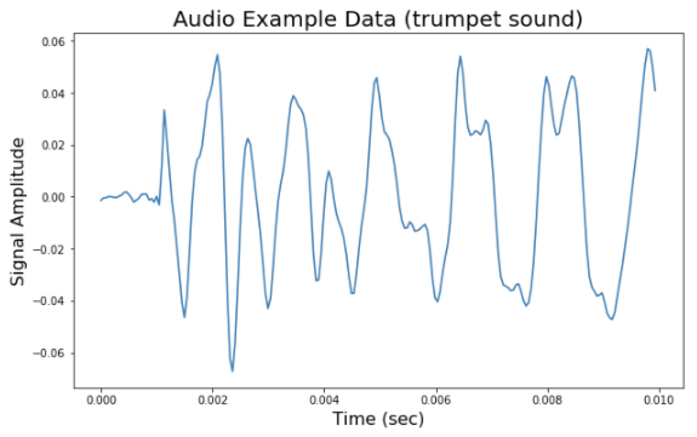

### 소리 데이터에 대한 이해

소리 데이터는 우리가 음악 파일, 영화 파일등을 통해 쉽게 접할 수 있습니다. 다만 소리 데이터가 어떻게 생겼는지는 익숙하지 않을 수도 있습니다. 소리데이터가 어떻게 생겼는지 알아보기 위해 직접 코드상에서 불러오고, 재생해보고, 그려보도록 하겠습니다.

이를 하기 위해서는  `librosa` 와 `matplotlib` , `sounddevice`  세가지 파이썬 라이브러리가 필요합니다. 

- `librosa` : 소리 데이터를 처리하는 라이브러리
- `sounddevice` : 소리를 재생시켜주는 라이브러리
- `matplotlib` : 시각화 라이브러리

필요한 라이브러리를 불러옵니다.

```python
import librosa
from matplotlib import pyplot as plt
import sounddevice as sd
```

소리 데이터를 알아보기 위해 `librosa` 에서 제공하는 트럼펫 예제 소리를 사용하려고 합니다. 해당 예제 파일은 다음 위치에 있습니다. 여러분들도 해당 경로에 직접 들어가서 음악 재생 프로그램으로 파일을 실행해보세요. `ogg` 파일이지만 음악 재생 프로그램으로 열어볼 수 있습니다.

```python
example_file_path = librosa.ex('trumpet')                         # (1)
print(f'예제 파일은 다음 위치에 있습니다.\n파일 경로: {example_file_path}')

# -----------------------------------------------------------------------------
# 예제 파일은 다음 위치에 있습니다.
# 파일 경로: /Users/henris/Library/Caches/librosa/sorohanro_-_solo-trumpet-06.ogg
```

(1) `librosa` 에서 제공하는 예제 파일 경로를 불러옵니다.

이제 해당 예제 파일에 담긴 소리를 우리가 파이썬에서 사용할 수 있도록 불러오도록 하겠습니다.

```python
y, sr = librosa.load(example_file_path)              # (1)
```

(1) `librosa` 라이브러리를 통해 파일에 담긴 소리를 불러옵니다. `y` 는 소리의 Amplitude 벡터, `sr` 은 Sampling Rate 를 의미합니다.

```python
용어 설명
Amplitude - 신호의 진폭 값
Sampling Rate - 초당 신호 값 개수
```

예제 파일을 파이썬 코드상으로도 재생시켜보도록 하겠습니다. 라이브러리를 사용하면 아주 간답합니다! 파이썬에서 실행한 소리와 음악 재생 프로그렘으로 실행한 소리가 같은지 비교해보시죠.

```python
sd.play(y) # (1)
```

(1) 신호 재생

두 소리가 같았나요? :)

위에서 불러온 `y` , `sr` 값을 직접 살펴보도록 하죠.

```python
print(f'y : {y}\nsampling_rate : {sr}') # (1)

# -----------------------------------------------------------------------------
# y : [-0.00140381 -0.00045776 -0.00039673 ...  0.          0.
#   0.        ]
# sampling_rate : 22050
```

(1) `y`와 `sr` 출력

`y` 는 신호의 진폭 값 벡터입니다. 작은 숫자들로 이루어져 있네요. `sampling rate` 가 22050 인 것을 보니 1초에 22050 개의 신호 진폭 값이 y에 들어있겠네요.

`y` 가 몇 개의 벡터인지 출력해보겠습니다.

```python
print(f'y는 {len(y)} 길이의 벡터') # (1)

# -----------------------------------------------------------------------------
# y는 117888 길이의 벡터
```

`y` 에 들어있는 실제 값을 조금 더 살펴볼까요? 아래와 같은 숫자들로 이루어져 있는 벡터군요.

```python
print(f'y의 앞 20개 값은?\n{y[:20]}')

# -----------------------------------------------------------------------------
# y의 앞 20개 값은?
# [-1.4038086e-03 -4.5776367e-04 -3.9672852e-04  9.1552734e-05
#   3.0517578e-05 -1.8310547e-04 -3.6621094e-04  1.5258789e-04
#   5.1879883e-04  1.4953613e-03  1.8615723e-03  9.1552734e-04
#  -3.9672852e-04 -2.0446777e-03 -1.2817383e-03 -5.4931641e-04
#   8.8500977e-04  9.7656250e-04  1.0070801e-03 -1.2817383e-03]
```

`y` 의 길이를 `sampling rate` 로 나누면 `y` 가 몇 초 데이터인지 알 수 있습니다.

```python
print(f'y는 {len(y) / sr} 초의 신호 벡터!')

# -----------------------------------------------------------------------------
# y는 5.346394557823129 초의 신호 벡터!
```

숫자만 보면 사실 감이 잡히지 않을 수도 있습니다. 방금 뽑은 `y` 벡터에 대해 시각화를 진행해보면 이해하는데 더 도움이 될 수 있을 것 같습니다.

```python
x = [i / sr for i in range(len(y))]  # (1)

plt.figure(figsize=(10, 6))  # (2)
plt.plot(x, y)  # (3)
plt.title('Audio Example Data (trumpet sound)', fontsize=20)  # (4)
plt.xlabel('Time (sec)', fontsize=16)  # (5)
plt.ylabel('Signal Amplitude', fontsize=16)  # (6)
plt.show()
```
(1) y 벡터의 각 값에 해당하는 초 값이 들어있는 리스트 만들기
(2) 시각화 figure 만들기
(3) 시간과 신호 진폭 값에 대해 시각화
(4) 타이틀 표시
(5) x 축 레이블 작성 (시간)
(6) y 축 레이블 작성 (신호 진폭)

우리가 얻었던 `y` 는 시간에 따라 대략 -0.6 에서 0.6 사이의 값을 가지는 벡터였던 것을 눈으로 확인 할 수 있습니다. 우리가 실제로 재생하면서 들었던 소리와 시각화 그림을 비교해보고, 소리가 이런식으로 벡터 값으로 나타낼 수 있는지 이해하면 좋을 것 같습니다.

> 예시 데이터 시각화 

시각화 한 김에 1초까지 확대해서 그려보겠습니다.

```python
plt.figure(figsize=(10, 6))
plt.plot(x[:sr], y[:sr])  # (1)
plt.title('Audio Example Data (trumpet sound)', fontsize=20)
plt.xlabel('Time (sec)', fontsize=16)
plt.ylabel('Signal Amplitude', fontsize=16)
plt.show()
```
(1) 1초까지의 데이터만 시각화


> 1초까지 시각화

1초까지 신호를 시각화한 모습입니다. 아직까지는 데이터가 뭉쳐보여서 각 값을 확인하기는 어려워 보이네요. 아래 에서 0.1초, 0.01초까지 확대해서 시각화해보고 각각 비교해보시기 바랍니다.

```python
plt.figure(figsize=(10, 6))
plt.plot(x[: sr // 10], y[: sr // 10])
plt.title('Audio Example Data (trumpet sound)', fontsize=20)
plt.xlabel('Time (sec)', fontsize=16)
plt.ylabel('Signal Amplitude', fontsize=16)
plt.show()
```


> 0.1초까지 시각화

```python
plt.figure(figsize=(10, 6))
plt.plot(x[: sr // 100], y[: sr // 100])
plt.title('Audio Example Data (trumpet sound)', fontsize=20)
plt.xlabel('Time (sec)', fontsize=16)
plt.ylabel('Signal Amplitude', fontsize=16)
plt.show()
```


> 0.01초까지 시각화

확대해서 볼수록 신호 벡터가 어떻게 생겼는지 감이 더 잘 잡히는 것 같습니다.

보신 바와 같이 librosa 라이브러리를 통해 소리데이터를 파이썬 코드상에서 불러올 수 있습니다. 우리가 불러온 y 벡터로 실제 소리에 대한 분석을 진행합니다. 다음 글에서는 실시간 비명 감지 시스템 프로젝트에 대해 알아보도록 하겠습니다.