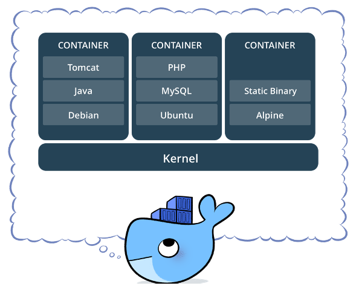

안녕하세요, 이번 게시물에서는 도커를 활용하여 컨테이너와 이미지에 대해 살펴보도록 하겠습니다.

## 도커 개요
도커는 컨테이너 기반의 오픈소스 가상화 플랫폼입니다.
* 가상화 : 하드웨어에 종속된 자원을 추상화함. 이를 통해 사용자는 원하는 리소스를 명시하기만 하면 됨.
* 컨테이너 : CPU 나 메모리 등의 자원을 격리하고 만들어진 가상적인 공간. 컨테이너 엔진이라는 프로세스를 통해 호스트 OS의 `커널`을 공유함. 쉽게 말하면, 내가 원하는 대로 가볍게 만든 컴퓨터
* 오픈소스 : 모두가 사용할 수 있는 프로그램
다시 말하자면, 도커를 통해 컨테이너를 만들 수 있고, 컨테이너는 내가 원하는 대로 만든 컴퓨터라고 생각해볼 수 있습니다. 내가 원하는 대로 라 함은 내가 원하는 OS 위에 내가 원하는 환경변수를 가지고 있거나, 파일 & 디렉토리 구조를 가지고 있는, 또 내가 원하는 파일을 실행하는 등을 의미합니다.
예시로 유명 웹 포털 서버도 컨테이너로 이루어져 있을 수 있고, 머신러닝 쪽에서는 모델을 학습하거나 추론하는 역할도 컨테이너가 수행할 수 있습니다.
> [커널 위에서 실행되는 컨테이너]  
## 컨테이너와 이미지
### 컨테이너와 이미지의 관계
결국 컨테이너는 내가 원하는 대로 만든 컴퓨터라고 했습니다. 이러한 컨테이너는 이미지를 통해 만듭니다.
* 이미지
  * 가상화 컴퓨터를 만드는 basis(클래스)
  * 여러 이미지 레이어로 이루어짐
  * 타인과 쉽게 공유 가능(파일 형태 혹은 dockerhub 등을 통해서)
* 컨테이너
  * 이미지의 실제 구현체(인스턴스, 객체)
  * 원하는 작업을 수행(프로그램 실행, 원하는 환경 구축 등)

### 이미지와 이미지 레이어의 관계
* 이미지 레이어
  * 각 이미지 레이어는 원하는 역할을 함
  * 각 레이어는 Dockerfile의 한 줄을 의미
* 이미지
  * 이미지 빌드는 이미지 레이어를 쌓는 것
  * 각 이미지 레이어가 모여 하나의 이미지를 만듬
  * 해당 이미지로 컨테이너 생성

### Dockerfile 과 이미지의 관계
* 도커파일의 한줄 = 이미지 레이어 한겹
* 이미지 레이어는 원하는 역할
* Dockerfile을 통해 이미지 빌드

## 직접 만들어보는 이미지와 컨테이너
백문이 불여일견이라고, 직접 도커파일을 통해 이미지를 만들고 컨테이너를 실행해보겠습니다.
### 기본 예제 도커파일
예시에서 보이는 도커파일은 5줄로 이루어져 있습니다. 이는 한 이지 레이어를 뜻합니다. 그리고 해당 레이어에서는 원하는 역할을 명시하고 있습니다.
1. 파이썬을 쓸 수 있는 가벼운 환경을 기반으로 하겠다.
2. 기본 apt 업데이트와 python3-dev 등 을 다운로드 하겠다.
3. `/test` 라는 디렉토리를 생성하고 이동하겠다.
4. `print('hello_docker!')` 라는 명령어가 있는`hello.py` 파일을 만들겠다.
5. 위에서 만든 `hello.py` 파일을 실행하겠다.
위 도커파일로 만든 이미지는 파이썬을 사용할 수 있는 가벼운 환경의 컴퓨터로써, 컨테이너를 실행하면 `hello_docker!` 라는 문구를 출력할 것입니다. 아래는 도커 명령어를 통해 실제로 이미지를 만들고 컨테이너를 실행하는 모습입니다.
#### 도커 명령어
* `docker build -t hunhoon21/hello.`
  * 현재 디렉토리에 있는 도커파일을 통해 이미지를 빌드합니다.
* `docker run hunhoon21/hello`
  * 빌드한 이미지를 실행합니다.
* `docker run -it hunhoon21/hello /bin/bash`
  * 이미지를 실행하면서 내부 컨테이너에서 `/bin/bash` 를 실행합니다.
  * 컨테이너에서 직접 들어가서 컨테이너를 살펴볼 수 있다는 의미입니다.

### torch 에서 GPU를 사용할 수 있는 컨테이너
우리는 컨테이너에서 딥러닝 모델을 활용할 예정이므로 GPU를 사용할 수 있어야 합니다. 컨테이너가 GPU를 사용하게 하기 위해서는 nvidia-docker 를 설치하고, cuda가 설치된 이미지 기반에서 이미지를 만들고, `runtime`에 nvidia를 추가해주면 됩니다.  
이 예제에서 살펴볼 점은 첫 줄에서 `nvidia` 가 제공하는 `cuda 10.2` 버전이 설치된 이미지를 활용한다는 점입니다. 또한 `torch.cuda.is_available()` 을 출력하는 파일을 넣어서 실행하여 GPU를 사용할 수 있다는 것을 확인하도록 하겠습니다.

