안녕하세요, 오늘은 `vim` 단축키를 익힐 수 있는 시간을 가지려고 합니다! `vim`은 우리가 흔히 사용하는 텍스트 편집기입니다. 먼저 `vim` 이 무엇인지 간단하게 짚고 넘어가도록 하겠습니다.

## vi 와 vim
`vim` 은 `vi` 라는 텍스트 에디터의 개량 버전입니다. 서버 환경에서는 텍스트 에디터를 활용하여 원하는 작업을 하는게 가장 편리한데요, 이때 `vim`의 기능을 잘 알고 활용할 수 있으면 작업 속도가 압도적으로 높아질 수 있습니다. 단축키가 복잡하여 익숙해지는데 시간이 조금 걸릴 수 있지만, 익숙해지고 나면 원하는 작업을 딜레이 없이 시켜주는 강력한 도구가 될 것입니다! 위 글에서는 단축키와 그 동작화면을 함께 보여주어 더 빠르게 익숙해지게 돕고자 합니다 :) (물론 저도 포함입니다!)
* `vi`
  * visual editor 의 줄임말
  * 1976년 빌 조이라는 분이 만들었다고 함
  * 당시에는 한 줄씩 편집했기 때문에 전체 화면을 사용한 인터페이스는 혁신적
* `vim`
  * vi improved의 줄임말
  * `vi` 에 여러가지 편의 기능이 추가되니 에디터
  * 대부분의 리눅스 시스템에 기본으로 탑재, `vi <원하는파일>` 명령어를 사용하면 `vim` 이 실행됨
  * 텍스트 기반으로 굉장히 가볍고 속도가 빠름
  * `emacs`, `nano` 가 비슷한 에디터로 사용자가 많음

## vim 단축키
그럼 본격적으로 `vim` 의 단축키를 살펴보겠습니다.

### 커서 이동
* 상하좌우 이동
  * `k`, `j`, `h`, `l`
  * 오른쪽에 있는 `k` 가 위에 있음
  * > [상하좌우] 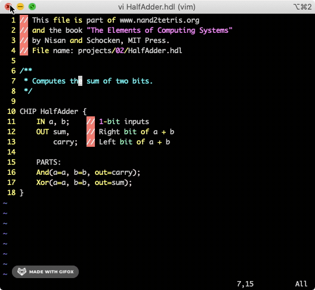
* 단어 앞에서 단어 단위로 이동
  * `w` - word 앞으로 이동
  * `b` - word 뒤로 이동
  * > [단어 앞에서 단어 단위] 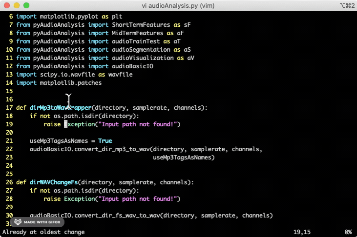
* 단어 뒤에서 단어 단위로 이동
  * `e` - word 앞으로 이동
  * `ge` - word 뒤로 이동
  * > [단어 뒤에서 단어 단위] 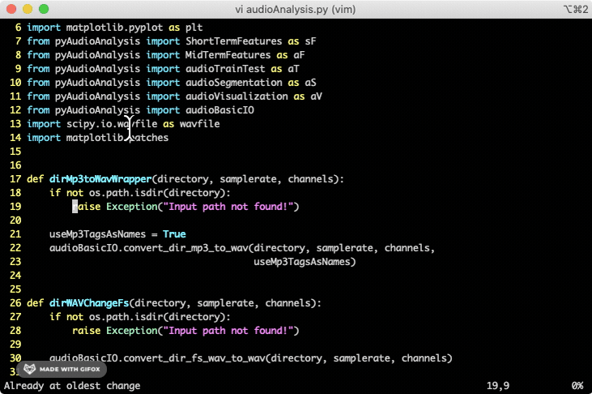
* 문장 맨 앞뒤로 이동
  * `^` - 문장 맨 앞으로 이동
  * `$` - 문장 맨 뒤로 이동
  * > [단어 맨 앞뒤] 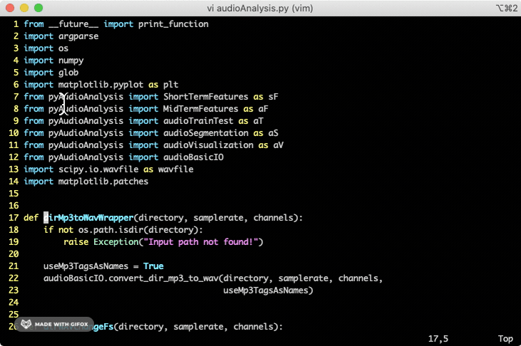
* 현재 페이지 처음, 중간, 끝 이동
  * `H` - 현재 페이지 처음으로 이동
  * `M` - 현재 페이지 중간으로 이동
  * `L` - 현재 페이지 끝으로 이동
  * > [현재 페이지 처음, 중간, 끝] 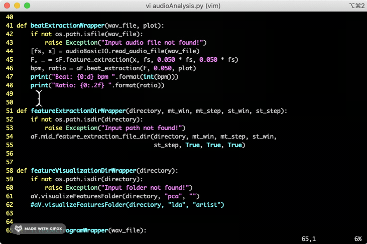
* 페이지 절반 위, 아래로 이동
  * `Control + u` - 페이지 절반 위로 이동
  * `Control + d` - 페이지 절반 아래로 이동
  * > [페이지 절반 위, 아래] 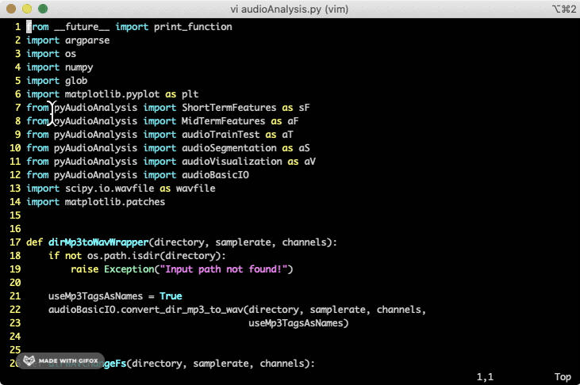
* 페이지 위, 아래 이동
  * `Control + u` - 페이지 위로 이동
  * `Control + d` - 페이지 아래로 이동
  * > [페이지 위, 아래] 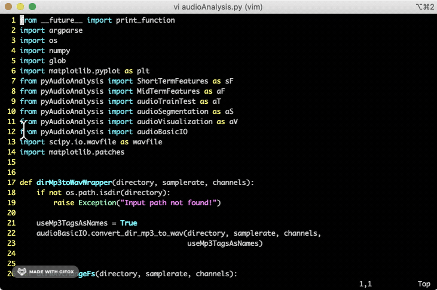
* 문장 단위 앞, 뒤로 이동
  * `(` - 문장 단위 앞으로 이동
  * `)` - 문장 단위 뒤로 이동
  * > [문장 단위 앞, 뒤] .gif)
* 문단 단위 앞, 뒤로 이동
  * `{` - 문단 단위 앞으로 이동
  * `}` - 문단 단위 뒤로 이동
  * > [문단 단위 앞, 뒤] 

### 찾기
* 현재 단위 기준 찾기
  * `*` - 현재 단어 기준 찾기
  * `n` 과 `N` 으로 단어 뒤 앞 이동
  * > [현재 단어 기준 찾기] 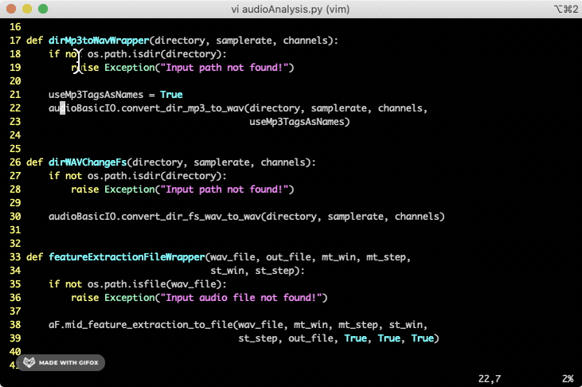
* 원하는 단어 찾기
  * `/` - 원하는 단어 입력
  * `n` 과 `N` 으로 단어 뒤 앞 이동
  * > [원하는 단어 기준 찾기] 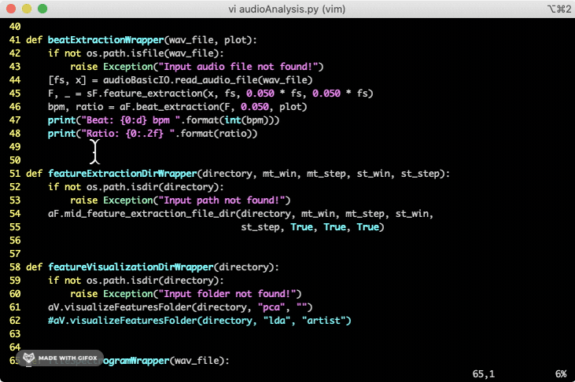

### 입력모드(insert) 들어가기
* 현재 위치에서 들어가기
  * `i`
  * > [현재 위치 편집] 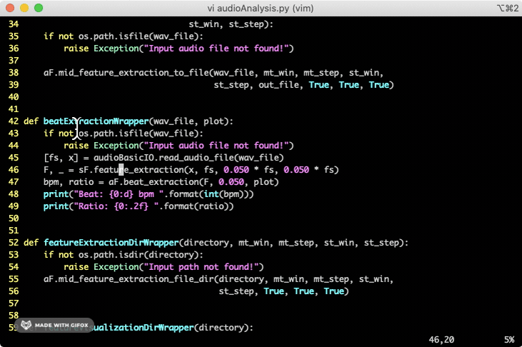
* 현재 위치 맨 앞에서 들어가기
  * `I`
  * > [현재 위치 맨 앞 편집] 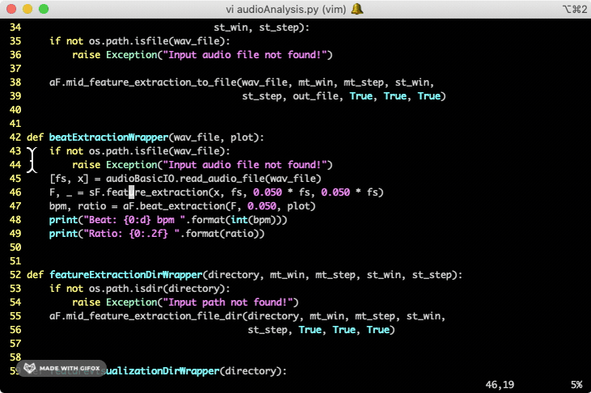
* 현재 위치 뒤에 들어가기
  * `a`
  * > [현재 위치 뒤 편집] 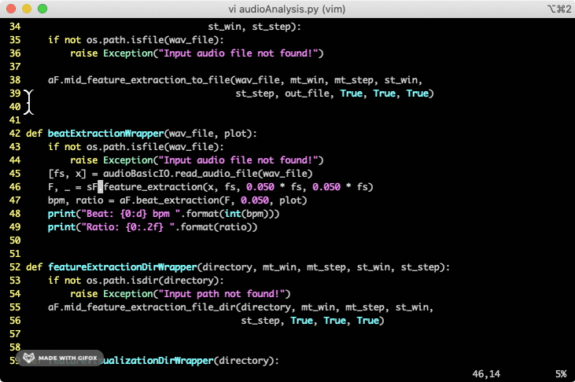
* 현재 위치 맨 뒤에 들어가기
  * `A`
  * > [현재 위치 맨 뒤 편집] 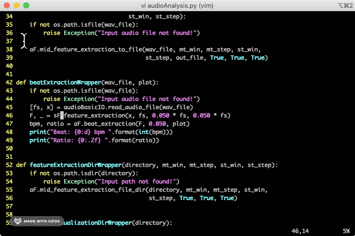
* 현재 위치 아래로 들어가기
  * `o`
  * > [현재 위치 아래 편집] 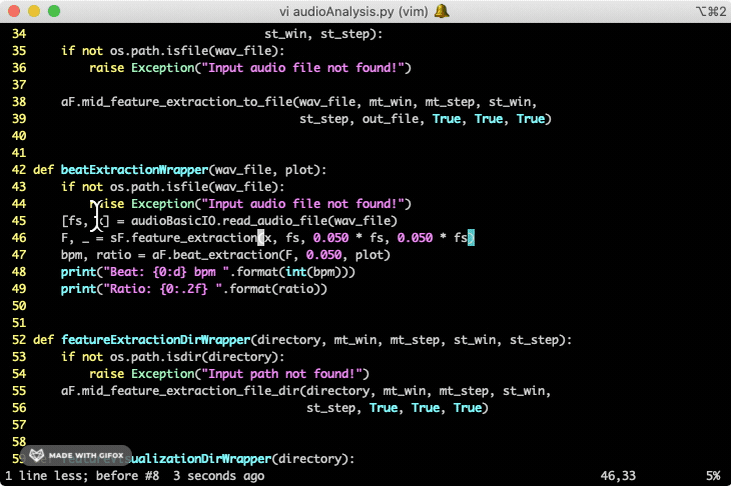
* 현재 위치 위로 들어가기
  * `O`
  * > [현재 위치 위 편집] 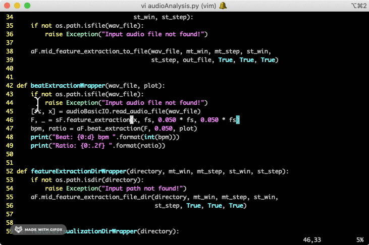
