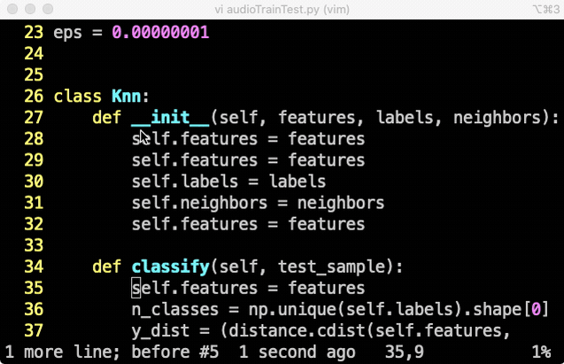

안녕하세요, 이번에도 지난 시간에 이어 `vim` 단축키를 익히는 시간을 가지려고 합니다! vim이 무엇인지와 커서이동, 찾기, 입력모드에 대한 단축키는 [이곳](https://hunhoon21.github.io/vim-%EB%8B%A8%EC%B6%95%ED%82%A4-%EC%9D%B5%ED%9E%88%EA%B8%B0(Feat.%EB%8F%99%EC%9E%91%ED%99%94%EB%A9%B4)-(1)/) 을 참고해주시기 바랍니다 :) 이번 포스트에서는 복사, 붙여넣기, 삭제, VISUAL 모드 활용에 대한 단축키를 다루겠습니다.

## vim 단축키
`vim` 의 단축키를 살펴보겠습니다.

### 복사, 붙여넣기, 삭제
* 한 줄 복사 후 붙여넣기
  * `y` - 해당 줄 복사
  * `p` - 붙여넣기
  * > [한 줄 복사 & 붙여넣기] 
* 여러 줄 복사 후 붙여넣기
  * `원하는 숫자` + `y` - 해당 줄 아래 원하는 숫자 줄 만큼 복사
  * `p` - 붙여넣기
  * > [단어 앞에서 단어 단위] 
* 한 줄 삭제
  * `dd` - 해당 줄 삭제
  * > [단어 앞에서 단어 단위] 
* 여러 줄 삭제
  * `원하는 숫자` + `dd` - 해당 줄 아래 원하는 숫자 줄 만큼 삭제
  * > [단어 앞에서 단어 단위] 

### VISUAL 모드 활용하기
VISUAL 모드는 vim에서 여러 줄에 대한 처리를 하고 싶을때 사용하는 모드입니다. 드래그와 비슷한 기능이라고 이해하면 될 것 같습니다. 우리가 드래그 할때와 마찬가지로 복사, 붙여넣기, 삭제 등의 기능을 함께 사용하는 경우가 많습니다. 따라서 아래 동작 화면에서는 복사(`y`), 붙여넣기(`p`)나 삭제(`d`) 기능도 같이 보이도록 하겠습니다. 또, VISUAL BLOCK 모드를 활용하면 multicursor 편집 기능도 사용할 수 있습니다.
* VISUAL 모드 들어가기
  * `v`
  * 보통의 드래그와 같은 기능
  * 방향을 움직여가며 드래그
  * > [VISUAL 모드 들어가기] 
  * > [VISUAL: 복사 & 붙여넣기] 
  * > [VISUAL: 삭제] 
* VISUAL LINE 모드 들어가기
  * `V`
  * 라인을 기준으로 드래그
  * > [VISUAL LINE 모드 들어가기] 
  * > [VISUAL LINE: 복사 & 붙여넣기] 
  * > [VISUAL LINE: 삭제] 
* VISUAL BLOCK 모드 들어가기
  * `Ctrl` + `v`
  * 현재 커서 위치부터 블록 형태로 드래그
  * > [VISUAL BLOCK 모드 들어가기] 
  * > [VISUAL BLOCK: 복사 & 붙여넣기] 
  * > [VISUAL BLOCK: 삭제] 
* VISUAL BLOCK 모드 활용: multicursor 편집 기능
  * 블록 + `I` - 블록 앞에 동일한 문자열 삽입
  * 블록 + `A` - 블록 뒤에 동일한 문자열 삽입
  * > [multicursor 편집] 
